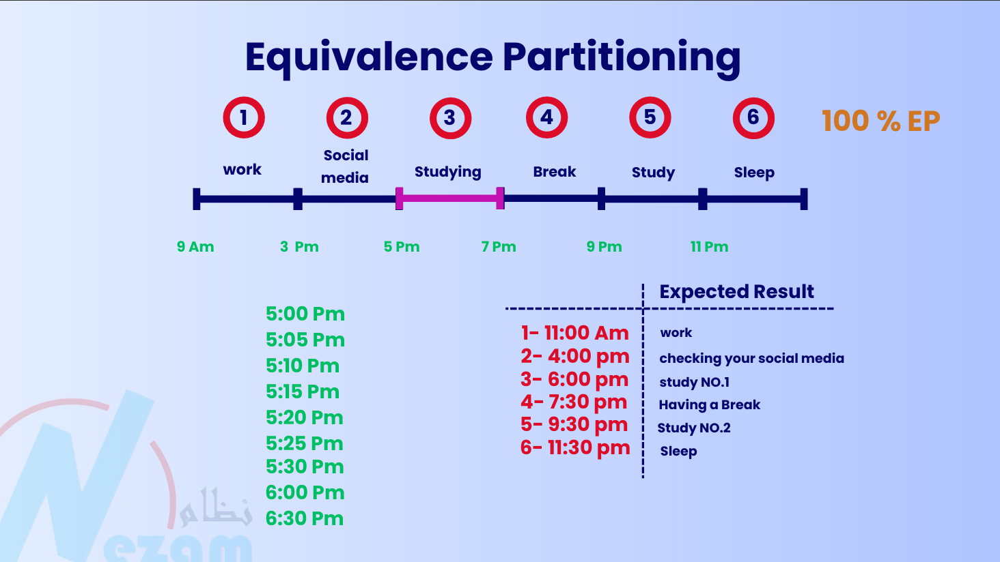
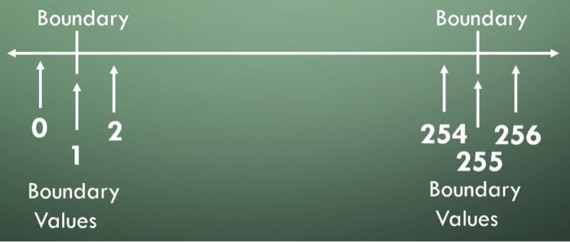
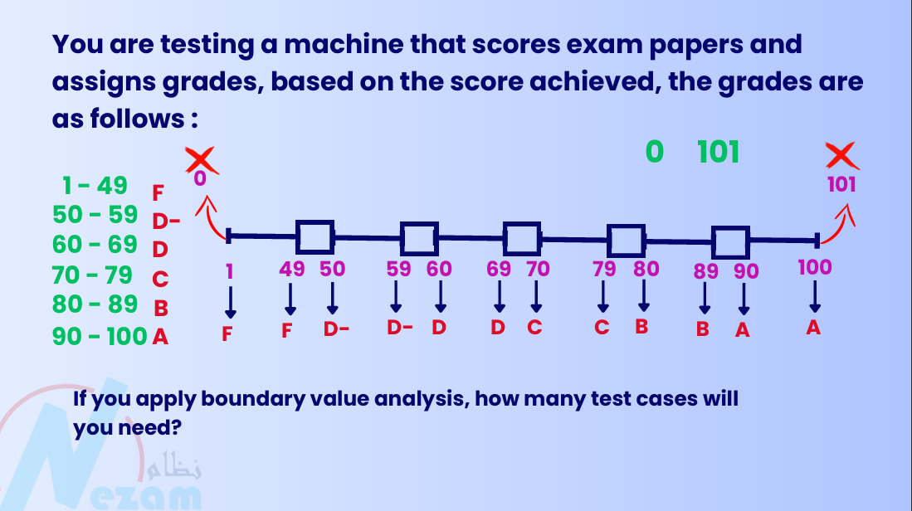
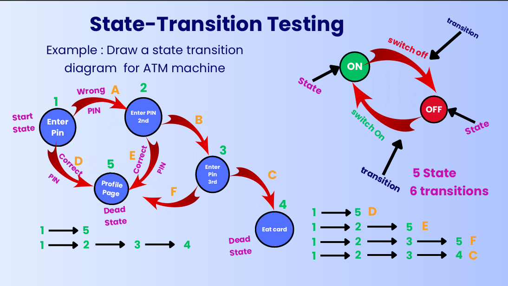
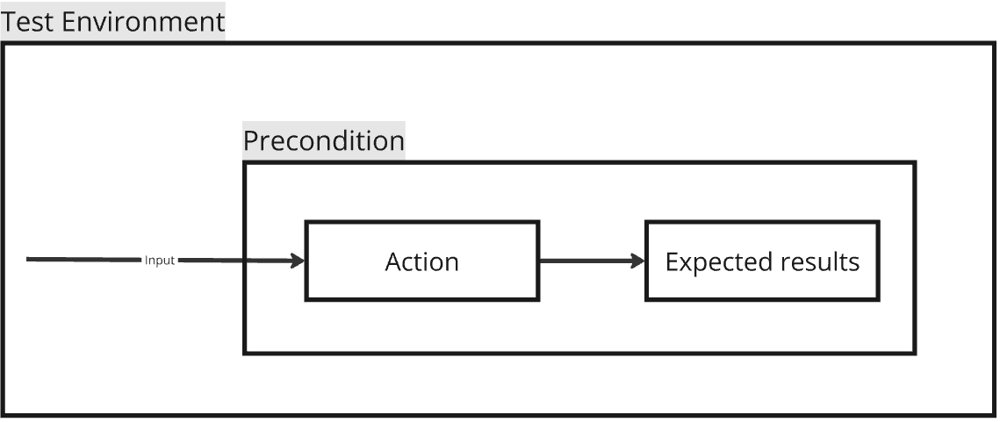
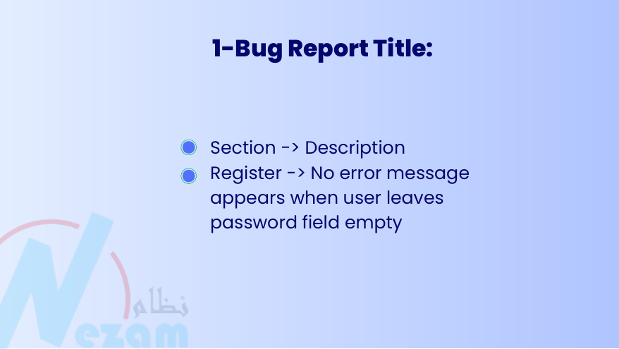
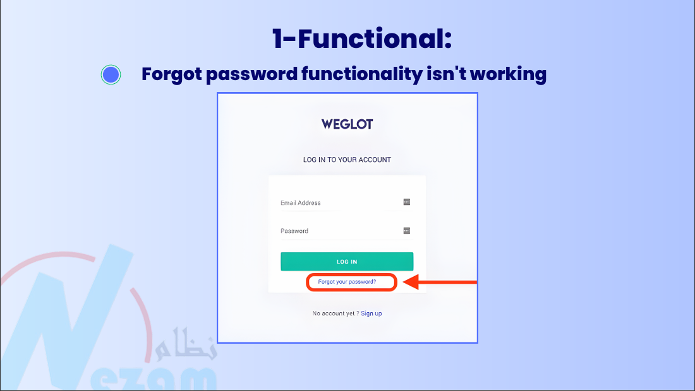
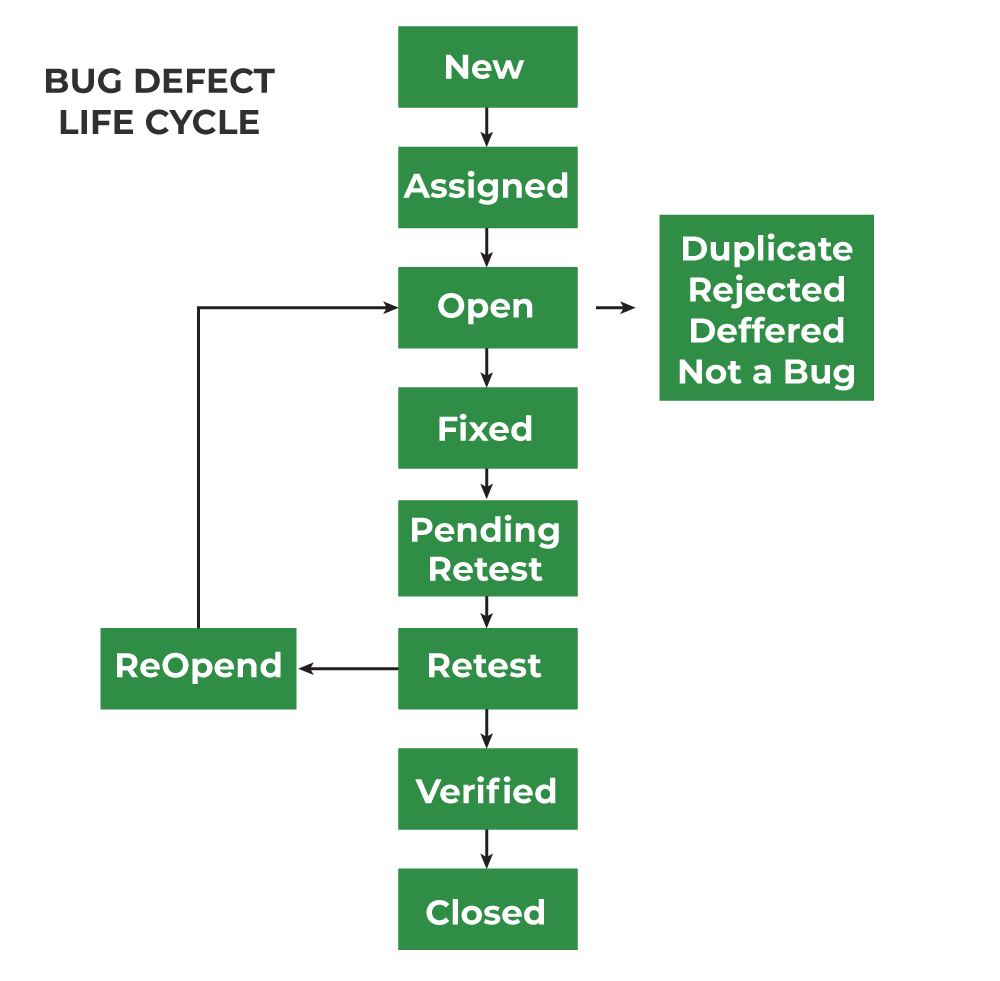

# Testing Course

This is Tarek Roshdy, Udemy AI generated notes, for [The Complete 2025 Software Testing Bootcamp](https://www.udemy.com/course/testerbootcamp/) 

## Roles in the Software Development Team

### Requirement Engineers

#### Introduction

Before discussing software testing, it is essential to understand the roles within a software development team. As a software tester, you do not work in isolation—you receive input from other team members and provide output to them. Understanding their responsibilities and the relationships between roles ensures efficient collaboration.

The roles discussed follow the sequence of the software development lifecycle (SDLC), starting from the beginning of the project. The first role in this sequence is the **Requirements Engineer**.

#### Role of the Requirements Engineer

A **Requirements Engineer** gathers requirements from the client and communicates them to the development team. This role is often known by different names in companies, such as:

- **Business Analyst**
- **Product Owner**

#### Business Analyst

A **Business Analyst (BA)** focuses on analyzing business requirements and conveying them to the development team. Their responsibilities include:

- Studying the market to identify opportunities for growth and revenue.
- Writing key documentation, such as:
  - **Software Requirements Specification (SRS)**
  - **Business Requirements Document (BRD)**

#### Product Owner

A **Product Owner (PO)** is primarily part of an **Agile team**. Their role is similar to a Business Analyst but is structured within Agile methodologies. Key aspects include:

- Writing requirements in the form of **User Stories**:
  - Format: "As a [type of user], I want to [perform an action] in order to [achieve a benefit]."
  - Accompanied by **Acceptance Criteria**, which define when the story is considered complete.

#### Deliverables and Interaction with a Software Tester

##### Business Analyst Deliverables

A software tester receives the following from a Business Analyst:

- **SRS and BRD Documents**
- In smaller companies, requirements may be conveyed orally.

A software tester's responsibilities include:

- Reviewing requirements for ambiguities, inconsistencies, and incompleteness.
- Deriving **test scenarios** and **test cases** from these requirements.

##### Product Owner Deliverables

A software tester receives the **Product Backlog**, which includes all User Stories. The tester's interaction with a Product Owner is typically:

- More informal, often involving **daily meetings**.
- Direct discussions about application functionality and correctness.
- Understanding User Stories and creating test cases accordingly.

#### Summary

- A **Requirements Engineer** collects and documents requirements.
- A **Business Analyst** focuses on business needs and writes SRS/BRD documents.
- A **Product Owner** works within Agile teams and writes User Stories.
- A software tester reviews requirements, ensures clarity, and creates test scenarios and cases based on the provided documentation.

### UI/UX Designers

UI and UX designers play a crucial role in software development by designing the application's interface and improving user experience. Understanding the distinction between UI and UX is essential.

#### UI Designer Responsibilities

1. **Requirement Gathering & Review**
   - After requirements are gathered and reviewed, ambiguities are cleared.
   - Ensures everyone understands what is to be developed.
2. **Design Creation**
   - The design phase can be a single step or iterative.
   - Tools like **Figma** are commonly used to create UI designs.
   - The first step often involves creating **wireframes**, which are rough sketches of the application layout.
     - Wireframes can be drawn on paper or digitally.
     - Saves time and budget by allowing early feedback before full design implementation.
   - Once approved, the wireframe is converted into a detailed UI design.
3. **Application of UI Design**
   - UI design acts as a reference for developers.
   - Websites and applications alike follow the same design process.

#### Role of a Software Tester in UI/UX

1. **Design Review & Feedback**
   - Testers do not create the UI design but are responsible for reviewing it.
   - Testers analyze:
     - Layout issues (e.g., misalignment of elements).
     - Accessibility concerns (e.g., color contrast for users with poor eyesight).
     - Logical flow (e.g., correct ordering of tasks).
   - Provides feedback to UI designers to enhance usability.
2. **Using Design for Testing**
   - Helps testers refine **test scenarios** and **test cases**.
   - If only a design is available (without formal requirements), testers create cases based on the UI.
   - If both requirements and UI design exist, testers must ensure alignment.
   - Example:
     - Initial test case: "Click on the button."
     - Improved with UI design: "Tap on the 'Add Task' button."

#### UI vs. UX

1. **UI (User Interface)**
   - The visual elements of the application (e.g., screens, buttons, layouts).
   - Created using tools like Figma.
2. **UX (User Experience)**
   - The overall interaction and satisfaction of the user.
   - Considers usability, accessibility, and efficiency.
   - Evaluates:
     - Ease of performing actions.
     - Complexity vs. simplicity based on target users (e.g., games for teenagers should be more complex).

#### UI/UX in Organizations

- Some companies have separate **UI Designers** and **UX Designers** (or usability experts).
- In many cases, a single **UI/UX Designer** handles both roles.

### Front-End, Back-End, & Mobile Developers

#### Understanding Development in the Software Lifecycle

- Development is not just about writing code; it includes requirements engineering and design creation.
- Many outside the software industry assume software development consists only of coding and testing, which is a misconception.
- Development activities include:
  - Requirements engineering
  - Design creation
  - Coding
- Software testers are involved beyond just reviewing or testing the final application.

#### Development Phases

1. **Requirements Creation**: Delivered to developers for feedback.
2. **Design Creation**: Sent to developers for implementation.
3. **Development Begins**: Involves multiple roles such as front-end, back-end, and mobile developers.

#### Key Developer Roles

##### Front-End Developer

- Responsible for implementing the UI design into interactive code.
- Works with technologies like:
  - **HTML** (Structure)
  - **CSS** (Styling)
  - **JavaScript** (Interactivity)
- Converts static designs into functional interfaces.

##### Back-End Developer

- Manages the logic and data storage behind the application.
- Responsible for:
  - Handling database operations.
  - Managing authentication and authorization.
  - Processing business logic.
- Often builds admin panels or dashboards for managing the application.
- Enables adding content (e.g., products on Amazon, courses on Udemy) that appears on the front end.
- Sometimes, the same person handles both front-end and back-end tasks, becoming a **Full-Stack Developer**.

##### Mobile Developer

- Develops applications for mobile platforms (Android & iOS).
- Works with different types of applications:
  - **Native Apps**: Developed separately for Android (Java/Kotlin) and iOS (Swift/Objective-C).
  - **Hybrid Apps**: Developed using a single codebase for both platforms.
- A more in-depth discussion is covered in the Mobile Testing section.

##### Software Testing Involvement

- Testers validate:
  - Front-end functionality after development.
  - Back-end functionality after development.
  - Integration between front-end and back-end (e.g., verifying data consistency between UI and database).
- Ensures that data actions performed in the backend reflect correctly in the front-end.

##### Summary

- Development encompasses more than just coding—it includes requirements and design.
- Front-end developers handle UI implementation.
- Back-end developers manage business logic and databases.
- Mobile developers build applications for smartphones.
- Software testers play a crucial role in verifying both individual and integrated functionalities.

### Project Manager & Scrum Master

#### Understanding Management Roles

- Software projects require structured management to coordinate tasks between different team members.
- Management roles vary based on company hierarchy and project methodology.
- The two main management roles are:
  - **Project Manager**
  - **Scrum Master**

#### Project Manager

- A traditional project manager responsible for overall team coordination.
- Often has a software background and manages schedules and deliverables.
- Responsibilities include:
  - Determining software delivery timelines for testers.
  - Allocating time for software testing before deployment.
  - Ensuring software is ready for production or release.

#### Scrum Master

- Applies to Agile teams, which are typically small (3-9 members).
- Acts as a team leader rather than a direct manager.
- Responsibilities include:
  - Motivating and guiding the team towards goals.
  - Supporting developers, product owners, and testers.
  - Facilitating Agile processes within the team.

#### Additional Roles in Software Development

- Companies may have other specialized roles, including:
  - **Data Scientist**
  - **Database Administrator**
  - **AI/Machine Learning Engineer**
  - **Big Data Engineer**
  - **DevOps Engineer**
  - **Ethical Hacker/Penetration Tester**
  - **Cloud Engineer**
- These roles support software development and infrastructure management.

#### Summary

- Development encompasses more than just coding—it includes requirements and design.
- Front-end developers handle UI implementation.
- Back-end developers manage business logic and databases.
- Mobile developers build applications for smartphones.
- Project managers coordinate development activities.
- Scrum masters facilitate Agile team processes.
- Software testers review and validate work across all roles.
- Additional specialized roles exist depending on company needs.

The next section will explore further aspects of software testing.

## Test Scenario Writing (Beginner)

### Creating Test Scenarios

Like we discussed in the previous section, from this video, we will begin our practical testing activities. The first activity that we are going to do is test scenario writing or test condition writing. This is the first step that you, as a software tester, will work on in any project that you are assigned to.

#### What is a Test Scenario?

Imagine that you joined a new project, the requirements are written, and then you are delivered those requirements. Your role is to review those requirements. As we discussed, reviewing the requirements is a static test activity. You review the requirements and understand them. Now, you need to prepare for dynamic testing.

The first step is to review the requirements and begin to generate test scenarios from them. The test scenarios are executed to identify and find defects in the software.

**A test scenario** is defined as any functionality that can be tested. Sometimes, it is called a **test condition** or **test possibility**. Some resources differentiate between a test scenario and a test condition, while others consider them the same. Since we are still beginning our learning journey in software testing, we will consider test scenarios and test conditions as the same.

Writing test scenarios or test conditions happens in the test analysis phase, which is the third step of the test process.

#### End-User Perspective in Test Scenarios

As a tester, you should put yourself in the end-user’s shoes. You need to think about:

- The functionalities and scenarios that the end-user will go through while using the application.
- The mistakes a user might make while using the application.
- Real-world scenarios and use cases of the application under test.
- High-risk functionalities where defects could lead to significant monetary or effort loss.

#### How to Create a Test Scenario

These are the main steps you can follow to write or identify your test scenarios:

1. **Study the Business Documents**
   - Review documents such as the Business Requirements Document (BRD), Software Requirements Specification (SRS), Functional Requirements Specification (FRS), user stories, use cases, and acceptance criteria.
2. **Isolate Every Requirement**
   - Identify functionalities like login, sign-up, cart management, etc.
3. **Identify Possible User Actions**
   - Determine the interactions a user can have with the application.
4. **Consider Technical Issues**
   - Think about potential problems associated with each requirement.
5. **Analyze System Abuse Scenarios**
   - Consider scenarios where hackers or malicious users might attempt to break the system.
6. **Write the Test Scenarios**
   - Enumerate test scenarios for each functionality or requirement.
   - Experience plays a role in deciding which scenarios are critical and which are less important.
   - Ensure your scenarios cover every valid and feasible user flow of the application or website.
7. **Traceability and Requirement Mapping**
   - Maintain bidirectional traceability between scenarios and requirements.
   - If requirements change in the future, you can identify which scenarios need updates.
   - If a test scenario fails, comparing it with the requirement helps determine if it is a defect.
8. **Review and Prioritize Scenarios**
   - Get stakeholders or senior testers to review scenarios for coverage, consistency, and validity.
   - Assign priority levels to test scenarios based on project needs.
   - Prioritization is essential when there is limited time for execution.
9. **Scenario Execution Strategy**
   - Depending on the project phase, decide which test scenarios to execute.
   - For instance, smoke testing may require running only specific scenarios, while regression testing involves running a broader set of tests.

By following these steps, you can systematically create and manage test scenarios, ensuring comprehensive coverage of the software under test.


### Tools to Help in Creating Test Scenarios

#### Using Google to Find Test Scenarios

The first resource is Google. For example, if you have an e-commerce website that needs testing, you can search for:

> "test scenarios for an e-commerce website."

You will find many resources that give you examples of scenarios relevant to what you are testing.

For example:

- **15 critical test cases for e-commerce websites** (even though some resources use "test cases," we are focusing on test scenarios here).
- Scenarios covering login/registration, payment gateway, product search, add to cart, etc.
- Each section provides multiple ideas on how to test specific functionalities.

Other websites may also provide test cases for login in platforms like Amazon. These are generally **test scenarios** rather than **test cases**, as they consist of **single-statement descriptions.**

Examples:

- **Test valid username and password**
- **Test 'Forgot Password' functionality**
- **Validate if the user is registered or not**

When using Google for scenarios, always compare them to your application. For instance, if a scenario mentions a "Forgot Password" link but your application does not include it, do not blindly copy it. Instead, generate your own scenarios based on the ideas presented.

If your application is complex or innovative (e.g., a medical application, a new game, or a social media platform with a unique idea), you may not find guidance online and will need to create test scenarios from scratch.

#### Using AI Tools Like ChatGPT for Test Scenarios

Another useful tool is **ChatGPT**. It can generate test scenarios based on provided functionality details.

Example prompt:

> "I have a login/sign-up functionality with four required fields (name, email, phone number, username) and two optional fields (address, country). Can you create test scenarios for it?"

**ChatGPT** will generate numerous scenarios, such as:

- **Handling empty fields**
- **Validating email format**
- **Checking username constraints**

You can refine the request further:

> "The username must be alphanumeric, between 5 and 20 characters. Can you create scenarios for this?"

**ChatGPT** will then focus on this specific requirement, generating scenarios for minimum and maximum lengths, invalid characters, and more.

#### The Role of a Software Tester

While AI can generate many scenarios, your role as a tester is to **select the most relevant ones**. In real projects, time constraints mean you cannot test every possible scenario.

For example, testing username lengths:

- **Minimum length: 5 characters**
- **Less than minimum: 4 characters**
- **Maximum length: 20 characters**
- **More than maximum: 21 characters**

This approach follows **Boundary Value Analysis (BVA),** which will be explained later. Whether testing at boundaries is critical depends on the application. If it's important to enforce character limits strictly, you should test these cases. If not, testing them may not be necessary as it consumes additional time.

Thus, AI tools and online resources can provide **guidance**, but finalizing test scenarios requires **human judgment and prioritization** based on the application and project constraints.

### Trello

​	Try to make a Trello account and use Kanban, scrum template.

### Facebook Login/Sign-up Testing

[Facebook Card](https://trello.com/b/O2w819Eq/aly)

### [Udemy Website Search](https://trello.com/b/O2w819Eq/aly)

## Black-Box Test Techniques

### Introduction

Welcome back.

In this section, we will discuss the Black-Box Test Techniques. As mentioned earlier, these techniques are used in **analysis** and **design** to help generate the best data for achieving the highest coverage of an application during these activities.

#### What is Black-Box Testing?

**Black-Box Testing** was previously discussed in the first section of this course under testing types. There are two main types of testing:

- **Black-Box Testing**: The tester provides input to the system and waits for the output without knowing the internal structure of the system.
- **White-Box Testing**: The tester provides input while having access to the internal structure of the system and then observes the output.

At a later stage, when discussing coding, White-Box Testing will be covered in detail. Additionally, there is **Gray-Box Testing**, which provides partial access to the system.

Examples of Gray-Box Testing include:

- **API Testing**
- **Database Testing**

Some people categorize these as White-Box Testing because they provide access to system components, while others classify them as Gray-Box Testing because they allow interaction with internal structures like APIs or databases without direct access to the code.

#### Application of Black-Box Test Techniques

Black-Box Test Techniques are primarily applied in:

- **System Testing**
- **Acceptance Testing**

As a software tester, your role includes:

- Understanding these techniques
- Applying them in appropriate scenarios

#### Example: Testing a Calculator Application

In Black-Box Testing:

1. The tester specifies the input.
2. During test execution, the tester provides input and waits for the output.
3. The tester does not know how the application processes the input (e.g., whether it treats numbers as integers or floats, how variables are named, or how methods operate internally).
4. If the output matches expectations, the system is functioning correctly; otherwise, there is a defect.

*Example test cases:*

- `2 + 3 = 5`
- `3 * 3 = 9`
- `10 * 0 = 0`
- `99,999 * 1 = 99,999`

Since **Black-Box Testing** focuses solely on **input-output behavior**, it is sometimes referred to as **behavioral-based testing**. The tester does not concern themselves with internal system operations, as this is the developer’s responsibility.

#### Five Main Black-Box Test Techniques

1. **Equivalence Partitioning**
   - Divides the system into partitions where each partition behaves similarly.
2. **Boundary Value Analysis**
   - Extends equivalence partitioning by focusing on boundary values.
3. **Decision Table Testing**
   - Used when multiple inputs affect the system’s response.
   - Example: A form with multiple questions where different combinations of answers yield different outcomes.
4. **State Transition Testing**
   - Used for complex systems with defined state changes (e.g., Sign Up → Login → Payment).
   - Common in hardware systems such as embedded systems or coffee machines.
5. **Pairwise Testing**
   - Used when there are multiple input combinations.
   - Example: Filtering results in a search engine.
   - Helps determine which input combinations should be tested and which can be skipped.

Each of these techniques is designed for specific scenarios and has its own application method. In the following videos, each technique will be explored in greater detail with real-life examples.

### Black-Test techniques Types

#### Equivalence Partitioning

**Introduction**

**Equivalence partitioning** is a **black-box testing** technique that helps reduce the number of test cases while maintaining good test coverage. Instead of testing at arbitrary times, equivalence partitioning ensures that each distinct partition of input data is tested at least once.

**Example Scenario**

Imagine you are planning your day with a structured schedule:

- **5:00 PM - 7:00 PM**: Studying software testing

- **7:00 PM - 9:00 PM**: Break

- **9:00 PM - 11:00 PM**: Studying again

- **11:00 PM onwards**: Sleeping

- **9:00 AM - 3:00 PM**: Working as a full-time tester

- **3:00 PM - 5:00 PM**: Social media and personal time

  

Now, suppose your friend is responsible for checking whether you are following your schedule. They may randomly check at different times:

- At **10:00 AM**, they ask if you are working.
- At **4:00 PM**, they ask if you are on social media.
- At **5:00 PM**, they check if you are studying.
- Similarly, they check at different intervals during other activities.

**Problem with Random Testing**

If we check multiple times within the same period (e.g., checking at **5:00 PM, 5:10 PM, 5:15 PM, etc.**), we are only verifying the "studying" partition multiple times while neglecting other partitions like "work" or "break."

**Concept of Equivalence Partitioning**

Each activity (work, social media, studying, break, and sleep) represents a **partition**. Instead of randomly selecting test cases, equivalence partitioning ensures that we test **one case per partition**:

| Partition    | Test Case (Example Time) |
| ------------ | ------------------------ |
| Work         | 11:00 AM                 |
| Social Media | 4:00 PM                  |
| Study 1      | 5:30 PM                  |
| Break        | 8:00 PM                  |
| Study 2      | 10:00 PM                 |
| Sleep        | 12:00 AM                 |

This approach provides **100% equivalence partitioning coverage** with only **six test cases**, instead of redundant tests.

**Application of Equivalence Partitioning**

Equivalence partitioning can be applied to any system where inputs can be grouped into partitions, such as:

- Time-based schedules
- Pricing categories
- Tax calculations
- Measurements like length, width, or currency
- Amount of money transactions

If a partition is not tested, it means there is a **gap in test coverage**, which could lead to missed defects in the system.

**Identifying Partitions**

Partitions can be determined in different ways:

1. **Intuitively**: Based on experience and logical classification.
2. **Explicitly Defined**: Mentioned in user stories, use cases, or business requirement documents.
3. **Consultation**: If partitions are unclear, they should be discussed with the **product owner**, **business analyst**, or **client** to validate correctness.

##### Equivalence Partitioning Examples  

###### Example 1: Grading System  
- A machine assigns grades based on scores:  
  - 1-49 → F  
  - 50-59 → D  
  - 60-69 → D+  
  - 70-79 → C  
  - 80-89 → B  
  - 90-100 → A  
- **Partitions:**  
  - Valid: (1-49), (50-59), (60-69), (70-79), (80-89), (90-100)  
  - Invalid: (<1), (>100)  
- **Test Cases (One per partition):**  
  - 25, 55, 62, 77, 81, 99, -5, 110  

###### Example 2: Age Validation  
- Signup form with age conditions:  
  - <13 → Error: "Too young"  
  - 13-100 → Welcome message  
  - Invalid → Error: "Enter a valid value"  
- **Partitions:**  
  - Valid: (13-100)  
  - Invalid: (<0), (>100), (Non-numeric)  
- **Test Cases:**  
  - 10, 25, -3, 150, "abc"  

**Note:** Invalid inputs can be multiple partitions if they produce different outputs.

**Conclusion**

Equivalence partitioning helps streamline testing efforts by ensuring each functional area of a system is adequately covered with minimal test cases. If partitions are not properly identified and tested, there may be issues in requirement coverage, leading to undetected errors in the system.

#### Boundary Value Analysis

**Introduction**

- Boundary-value analysis is an extension of equivalence partitioning.
- If equivalence partitioning is applied, boundary-value analysis should also be considered.

**When to Choose Boundary-Value Analysis vs. Equivalence Partitioning**

- **Equivalence Partitioning**
  - Simpler method.
  - Lower coverage.
  - Used when the system is simple and defects have a low impact.
- **Boundary-Value Analysis**
  - More complex but has higher failure detection probability.
  - Used when the system is complex and defects have a high impact.
  - Requires clear partition boundaries.

**Importance of Boundaries**

- Some systems do not have strict boundaries, **e.g.**, a study schedule where studying can end at 6:59 or 7:01 without significant consequences.
- Other systems have strict boundaries, e.g., speed limits where 120 km/h incurs no fine, but 121 km/h does.

**Example of Boundary-Value Analysis**

- Consider a system operating between **5:00 PM and 7:00 PM**.
  - **Equivalence Partitioning**: Testing at 6:00 PM, 5:30 PM, or 6:30 PM is acceptable.
  - **Boundary-Value Analysis**:
    - Test at exact boundaries: **5:00 PM and 7:00 PM**.
    - Test values just outside the boundary: **4:59 PM and 7:01 PM**.
    - Ensures coverage of transition points between partitions.

**Boundary Test Values**

- For each boundary:
  - Test the **last value** from the first partition.
  - Test the **first value** of the second partition.
- Example:
  - Boundary at 5:00 PM → Test **4:59 PM** (previous partition) and **5:00 PM** (current partition).
  - Boundary at 7:00 PM → Test **6:59 PM** (current partition) and **7:00 PM** (next partition).

**Variations of Boundary-Value Analysis**

- **Two-Value Boundary Analysis**
  - Preferred method.
  - Tests the two critical boundary values (last of the previous partition and first of the next partition).
- **Three-Value Boundary Analysis** (Skipped as it is not deemed essential).
  

**Common Developer Mistakes at Boundaries**

- Miswriting conditional statements:

  - Forgetting "equal to" in conditions.
  - Using "greater than" instead of "greater than or equal to".

- Duplicating boundary values in multiple conditions:

  ```
  if (x >= 5) {
      // Do something
  } else if (x <= 5) {
      // Do something else
  }
  ```

  - Here, `5` appears in both conditions, leading to potential logic errors.

##### Boundary Value Analysis Example

- Boundary-value analysis applies to systems with well-defined partitions.
- Instead of testing any value within a partition, test the first and last values.
- Example: Exam grading system.

###### Example 1: Grading System Partitions



**Test Cases**

- Boundary values for each partition:
  - **F → D-**: 49, 50
  - **D- → D**: 59, 60
  - **D → C**: 69, 70
  - **C → B**: 79, 80
  - **B → A**: 89, 90
  - **A (Max value)**: 100
  - **Invalid Partitions**:
    - Below valid range: 0
    - Above valid range: 101

**Key Points**

- 14 test cases compared to ~7 in equivalence partitioning.
- More complex but ensures better defect detection.
- Decision to use depends on system complexity and requirement clarity

###### Example 2: Age validation Registration System

- `< 13`: Too young
- `13-100`: Welcome message
- `> 100`: Invalid

**Test Cases:**

| Input Type | Test Value | Expected Result | Test Validity Type |
| ---------- | ---------- | --------------- | ------------------ |
| Age        | 12         | Too young       | Invalid            |
| Age        | 13         | Welcome message | Valid              |
| Age        | 100        | Welcome message | Valid              |
| Age        | 101        | Invalid         | Invalid            |

- If input is month and year of birth (testing in Jan 2020):
  - Test **Jan 2007 (valid)** and **Feb 2007 (invalid)**.
- If input is exact date of birth:
  - Test **5th Jan 2007 (valid)** and **6th Jan 2007 (invalid)**.
- Leap year case (29th Feb 2020):
  - Test **28th Feb 2007 (valid)** and **1st March 2007 (invalid)**.

**Conclusion**

- Boundary-value analysis is critical for systems with strict partitions.
- Helps uncover defects at transition points where developers commonly make errors.

#### Notes About Equivalence Partitioning & Boundary-Value Analysis

**Partitioning Rules**

- Each value belongs **only** to one partition.
- A value **cannot** belong to two partitions simultaneously.
- If ambiguity exists, consult the product owner or business analyst.

**Applicability**

- Both **Equivalence Partitioning (EP)** and **Boundary-Value Analysis (BVA)** can be applied to:
  - **Input values**: Partitions exist in the input domain.
  - **Output values**: Partitions exist in the output domain.
- **Example:**
  - **Input-based partitioning**: Grades (A, B, C) based on input values.
  - **Output-based partitioning**: A system categorizes values into partitions after processing.

**Valid vs. Invalid Partitions**

- Always consider both **valid** and **invalid** partitions.
- Questions to ask:
  - Where are the **valid partitions**?
  - Where are the **invalid partitions**?
  - Is it possible to test **invalid partitions**?
  - How does the system handle errors in invalid partitions?

**Coverage Measurement**

- **Equivalence Partitioning Coverage**:
  - Formula: `(Covered Partitions / Total Partitions) * 100%`
  - Goal: Achieve **100% partition coverage**.
- **Boundary-Value Analysis Coverage**:
  - Count **all covered boundaries**.
  - Each boundary consists of **two values**:
    - The **last value** of the first partition.
    - The **first value** of the second partition.
  - Formula: `(Covered Boundaries / Total Boundaries) * 100%`
  - Goal: Achieve **100% boundary coverage**.

**Testing Strategy**

- **Testing multiple values from the same partition does not increase coverage**.
- In **Equivalence Partitioning**:
  - Only **one representative value** per partition is needed.
- In **Boundary-Value Analysis**:
  - Test **two values** per boundary:
    - First value of the partition.
    - Last value of the partition.

**Abbreviations**

- **EP** = Equivalence Partitioning
- **BVA** = Boundary-Value Analysis
- Commonly used in job assessments, interviews, and technical documentation.

#### Decision Table Testing

**Overview**

Decision Table Testing is a black-box test design technique used when multiple conditions influence different outcomes. It is particularly useful when dealing with complex business rules.

**When to Use Decision Table Testing**

- When there are multiple conditions affecting system behavior.
- When requirements are presented in tabular format.
- When test coverage must be maximized efficiently.

**Example Scenario**

Consider a discount system where:

1. A customer must purchase items worth more than 100 USD.
2. The customer must have a Gold Subscription.

These two conditions determine whether a discount is applied.

**Structure of a Decision Table**

A decision table consists of:

- **Conditions (Inputs):** Factors affecting the outcome.
- **Actions (Outputs):** The system's response.
- **Rules:** Unique combinations of conditions leading to specific actions.

| More than 100 USD | Gold Subscription | Discount Applied |
| ----------------- | ----------------- | ---------------- |
| True              | True              | Yes              |
| True              | False             | No               |
| False             | True              | No               |
| False             | False             | No               |

**Formula for Calculating Test Cases**

The number of test cases required for full coverage follows:

**Where:**

- **X** = Number of possible values per condition (e.g., 2 for True/False, 3 for Yes/No/Maybe)
- **N** = Number of conditions

**Example:**

- If there are **3 conditions** with **2 values each**, the number of test cases is: 2^3 =8
- If there are **2 conditions** with **3 values each**, the number of test cases is: 3^2 =9

**Optimizing Decision Tables**

- **Minimization:** Remove redundant test cases where multiple combinations yield the same result.
- **Equivalence Partitioning:** Group similar inputs to reduce test cases.
- **Boundary Value Analysis:** Test around key threshold values.

**Practical Considerations**

- Some systems have too many possible conditions to achieve full test coverage.
- Decision Table Testing can be combined with other techniques for efficiency.
- Requirements may be presented as tables in documentation (e.g., SRS, BRD, use cases, user story).
- If requirements are in text form, converting them into a decision table can clarify expected behaviors.

**Limitations**

- **Scalability Issues:** A large number of conditions exponentially increases test cases.
- **Alternative Techniques:** In some cases, Equivalence Partitioning or Boundary Value Analysis may be better suited.

**Example – Exam Scoring System**

An exam has **40 questions**, each with **4 possible answers**. To cover all possible combinations:

 (Over a trillion test cases – impractical!)

**Instead, we simplify:**

- Students scoring **≥ 65%** pass.
- Students scoring **< 65%** fail.
- We can use Equivalence Partitioning and Boundary Value Analysis to test around the **65% cutoff**.

##### Decision Table Testing Example

**Overview**

This example demonstrates decision table testing applied to a **speeding fine system**. The goal is to achieve **100% test coverage** by selecting appropriate test cases.

**Decision Table Structure**

The system has two conditions:

1. **Speed > 50?** (Yes/No)
2. **Is this a school zone?** (Yes/No)

Based on these conditions, we derive four possible rules:

| Rule | Speed > 50 | School Zone | Action     |
| ---- | ---------- | ----------- | ---------- |
| R1   | Yes        | Yes         | Go to Jail |
| R2   | Yes        | No          | Pay a Fine |
| R3   | No         | Yes         | No Action  |
| R4   | No         | No          | No Action  |

**Existing Test Cases**

Two test cases are already designed:

- **R1:** (Speed > 50, School Zone) → **Go to Jail**
- **R4:** (Speed ≤ 50, Not School Zone) → **No Action**

**Additional Test Cases**

The system provides four additional test cases:

| Test Case | Speed | School Zone | Covered Rule?  |
| --------- | ----- | ----------- | -------------- |
| DT1       | 55    | Yes         | Duplicate (R1) |
| DT2       | 44    | Yes         | Covers R3      |
| DT3       | 66    | Yes         | Duplicate (R1) |
| DT4       | 77    | No          | Covers R2      |

**Achieving 100% Coverage**

To achieve full coverage, we need test cases for:

- **True, False** (Speed > 50, Not a School Zone) → **Pay a Fine** (Covered by DT4)
- **False, True** (Speed ≤ 50, School Zone) → **No Action** (Covered by DT2)

**Final Test Set for 100% Coverage:**

- **R1 (Existing)** → Speed > 50, School Zone → **Go to Jail**
- **R4 (Existing)** → Speed ≤ 50, Not School Zone → **No Action**
- **DT2 (New)** → Speed ≤ 50, School Zone → **No Action**
- **DT4 (New)** → Speed > 50, Not School Zone → **Pay a Fine**

**Key Takeaways**

- Decision tables help visualize test case coverage.
- Existing test cases may provide **incomplete coverage**.
- Additional test cases can be selected **systematically** to ensure **full decision table coverage**.
- In real-life scenarios, test cases may exist in a **test suite**, requiring testers to **analyze and optimize** coverage without always drawing a table.

**Conclusion**
Decision Table Testing is a powerful technique for handling complex logical conditions but must be used wisely to ensure feasibility. In cases where exhaustive testing is impractical, optimization techniques help achieve effective coverage.

#### State Transition Testing

**Definition**

State-transition testing is a black-box testing technique that involves defining states and transitions in a system.

**States and Transitions**

Each **state** is a condition in which the system can rest. Transitions occur when the system moves from one state to another.

**Example: An ATM machine**

1. The system asks the user to enter a **PIN number**.

2. If the PIN is **correct**, the system transitions to the **profile page**.

3. If the PIN is **incorrect**, the system prompts for re-entry.

4. After three incorrect attempts, the **card is ejected or retained**.

   

   

**Coverage Criteria**

1. **State Coverage:** Ensuring all states are tested.
2. **Transition Coverage:** Ensuring all transitions between states are tested.

**State Coverage**

- The minimum coverage criterion.
- Covers all possible states in the system.
- Example: Test cases ensure all states like "Enter PIN", "Profile Page", and "Card Retained" are reached.

**Transition Coverage**

- More comprehensive than state coverage.
- Covers all possible transitions between states.
- Example: If there are **five states** and **six transitions**, all six transitions must be tested.
- Ensures implicit state coverage.

**Example of Transition Coverage**

- A test case can transition directly from "Enter PIN" to "Profile Page" (1 → 5).
- Another test case transitions through incorrect attempts (1 → 2 → 3 → 4 → Eat Card).
- Additional test cases are needed to cover all transitions (A, B, C, D, E, F).
- **Dead States:** States with incoming transitions but no outgoing transitions (e.g., "Profile Page", "Card Retained").

**Test Case Design for Coverage**

1. **State Coverage:** Requires two test cases:
   - One going directly to the profile page.
   - One failing three times and resulting in card retention.
2. **Transition Coverage:** Requires four test cases:
   - Ensuring all paths (correct and incorrect attempts) are covered.
   - Covering all transitions A, B, C, D, E, and F.

**Key Takeaways**

- **Start State:** The initial system state.
- **Dead States:** No further transitions possible.
- **State Coverage vs. Transition Coverage:**
  - State coverage requires fewer test cases.
  - Transition coverage ensures more detailed testing.
- Some systems may have **infinite loops** with no fixed start state.
- **More advanced coverage techniques exist**, but state and transition coverage are fundamental for beginners.

**Simple Example**

- **States:** On, Off.
- **Transitions:** On → Off, Off → On.
- Each transition represents a state change, requiring test coverage.

#### PairWise Testing

**What is Pairwise Testing?**

Pairwise testing is a technique applied in specific cases inside websites or applications. For instance, consider a form with three fields, each containing multiple options or values. Testing all possible combinations would be impractical due to time constraints and low return on investment.

Pairwise testing helps achieve sufficient test coverage with fewer test cases. The goal is to ensure that each pair of values appears together in at least one test case.

**Example Scenario**

Consider Udemy's filtering options:

- **Ratings**: 4.5 and up, 4 and up, 3.5 and up, 3 and up (4 choices)
- **Video Duration**: 0-1 hour, 1-3 hours, 3-6 hours, 6-17 hours, 17+ hours (5 choices)
- **Level**: All levels, Beginner, Intermediate, Expert (4 choices)

To test each filter separately:

- Ratings: 4 test cases
- Video Duration: 5 test cases
- Level: 4 test cases

This results in **13 test cases** but does not cover combinations. Testing all possible combinations would require:

 test cases, which is excessive.

**Applying Pairwise Testing**

Pairwise testing ensures that each pair of values appears together **at least once** in a test case, minimizing the total number of test cases required while maintaining effective coverage.

**For example:**

- One test case might include "4.5 and up" with "0-1 hour" and "All levels."
- Another test case might include "4.5 and up" with "0-1 hour" and "Beginner."
- Another test case might include "0-1 hour" with "All levels."

However, there is no guarantee that all values will appear in a single test case.

**Generating Pairwise Test Cases**

Creating test cases manually for pairwise testing can be complex. Instead, tools can generate optimized test cases efficiently. One such tool is:

[Pairwise Testing Tool 1](https://pairwise.yuuniworks.com)
[Pairwise Testing Tool 2](https://pairwise.teremokgames.com/)

**Steps to Generate Pairwise Test Cases:**

1. Open the tool.
2. Define input variables and their possible values.
3. Set constraints if necessary (e.g., "Expert level requires at least 3 hours of content").
4. Click "Generate" to get the optimized test cases.

**Benefits of Pairwise Testing**

- Reduces the number of test cases significantly.
- Ensures critical combinations are tested.
- Saves time while maintaining effective test coverage.
- Avoids redundancy and unnecessary test efforts.

By applying pairwise testing, testers can efficiently validate system behavior without exhaustive combinatorial testing, making it an essential black box testing technique.

#### Summary

**Black Box Testing Techniques**

- Equivalence partitioning
- Boundary value analysis
- Decision table testing
- State transition testing
- Pairwise testing

**Skills Acquired**

- Writing test scenarios
- Applying black box testing techniques

**Application of Techniques**

- When writing test scenarios and test cases
- During exploratory testing to find defects
- In advanced testing topics like ABI testing, performance, and automation
- Always consider which technique is suitable for each test scenario

**Gaining Expertise**

- Experience helps in identifying the best techniques for different systems
- Continued practice improves testing skill


## Testing Case Writing [Beginner]

### How to Write a Test Case

In this section, we will begin talking about how to write a test case. We will start by identifying what a test case is, why we write it, and then explore how it is written. After this, we will use a testing tool to write our test cases.

Test case writing is one of the most important skills for a software tester. Most testing projects include writing test cases. Sometimes, we create test cases from test scenarios.

- **Step 1:** Write test scenarios (as done in the previous section).
- **Step 2:** Write test cases directly without writing test scenarios.

### Types of Testing Projects

There are three types of projects regarding test cases:

1. Some projects write only test scenarios and execute them.
2. Some projects write only test cases and execute them.
3. Some projects start with test scenarios and clarify them with test cases.

The decision to use scenarios, test cases, or both is made by test managers based on experience and project needs.

### Understanding Test Cases

A **test case** is a document that includes:

- Preconditions
- Inputs
- Actions
- Expected results



#### Differences Between Test Case and Test Scenario

- **Test Scenario:** A one-line condition (e.g., "Verify login").
- **Test Case:** A detailed document with multiple fields.

If time is limited, writing test scenarios might be preferable. If the project has high risks, writing test cases is more beneficial.

#### Components of a Test Case

##### 1. Title

- Should be **unique**.
- Should not be **too long** (e.g., three lines) or **too brief** (e.g., "Verify login").

##### 2. Preconditions

- Important for setting up the test environment.
- Example: "User is already registered using valid credentials."
- Can include multiple conditions like:
  - Internet connection availability
  - Browser updates
- Some test suites share a common precondition for all test cases.

##### 3. Test Steps

- Steps to execute the test case.
- Essential for complex systems.
- Should follow a **consistent format**:
  - **Second-person format:** "Enter a valid username."
  - **Third-person format:** "The user enters a valid username."
- Should not include preconditions in steps.
- Recommended range: **2 to 9 steps**.

##### 4. Expected Result

- Defines the expected behavior of the system.
- Example: "User is redirected to the homepage after successful login."
- Can vary based on business decisions (e.g., redirection to a dashboard, newsfeed, inbox, etc.).

##### 5. Test Suite

- A collection of related test cases.
- Names vary based on the testing tool:
  - **Test Suite**
  - **Test Folder**
  - **Feature**
  - **Condition**
- Example: A "Login" test suite contains test cases related to login functionality.

##### 6. Test Environment

- Specifies where the test will be executed.
- Critical for cross-platform applications.
- Example:
  - "Executed on Windows and Mac."
  - "Executed on mobile devices (**4G, 5G**)."

This structured approach ensures clarity and consistency in writing test cases, making them effective and manageable in a testing environment.

##### 7. Actual Result

Never fill the actual result field until you execute your test case.

##### 8. Status

Pass, Fail,  Blocked, Skipped, etc.

##### 9.Priority

##### 10.Defect Reporting 

* If discrepancies exist, they are documented and reported.

**Example** 
**Test Case: Verify Successful Login**

| **Component**        | **Description**                                              |
| -------------------- | ------------------------------------------------------------ |
| **Test Case ID**     | TC-001                                                       |
| **Title**            | Verify Successful Login with Valid Credentials               |
| **Priority**         | High                                                         |
| **Preconditions**    | - User is already registered.<br>- Internet connection is available.<br>- Browser is updated to the latest version. |
| **Test Steps**       | 1.1 Open the login page.<br>1.2 Enter a valid username.<br>1.3 Enter a valid password.<br>1.4 Click on the "Login" button. |
| **Expected Result**  | - User is redirected to the homepage.<br>- A success message is displayed. |
| **Test Suite**       | Login Functionality                                          |
| **Test Environment** | - Windows 11, macOS Ventura.<br>- Chrome (latest), Firefox (latest).<br>- Mobile (Android 13, iOS 17) under Wi-Fi and 4G. |
| **Actual Result**    | _(To be filled after execution)_                             |
| **Status**           | _(Pass, Fail, Blocked, Skipped, etc.)_                       |
| **Defect Reporting** | If discrepancies exist, they are documented and reported.    |

**Notice two things in your test case:**

1. **High-Level vs Low-Level Test Cases**
   - **High-Level Test Cases**:
     - Focus on overall functionality without specifying test data.
     - Suitable for experienced testers.
     - Provides better system coverage.
   - **Low-Level Test Cases**:
     - Includes specific data values.
     - Useful for critical systems and inexperienced testers.
2. **Concise vs Detailed Test Steps**
   - Depending on project needs, test steps can be:
     - **Detailed**: Each step is explicitly listed.
     - **Concise**: Grouping steps into general instructions.
   - The choice depends on the complexity of the system and team experience.

By following this structured approach, test cases become more organized, traceable, and effective in ensuring software quality.

[Tarek Roshdy test case register](https://docs.google.com/spreadsheets/d/1DDWOfdn40_3l4joDKN6w73TdEl-JwTdKwHoDRyZ9gMc/edit?gid=509497296#gid=509497296)

## Test Case Writing using Zephyr Scale

**Note:**
**Gherkin Script:**

```gherkin
Given:
When:
Then:
And:
```

[Add Zypher application to your Kanban Jira template and play with it](https://www.atlassian.com/software/jira)

## Data driven testing


## Test Execution & Bug Reporting [ Beginner ]  

### Introduction to Defect Reporting  

Defect reporting is a crucial skill for software testers for two main reasons:  

1. **Primary Documentation** – In many projects, testers use **exploratory testing** instead of writing test cases, making defect reports the first and sometimes the only documentation.  
2. **Cross-Team Communication** – Defect reports are shared with developers, so they must be clear and detailed to avoid miscommunication and ensure reproducibility.  

### Defect Report Writing

#### What is a Defect Report?

A defect report is a documentation of the occurrence, nature, and status of a defect in an application. It records the details of a problem that causes a difference between expected and actual results. The defect itself is the problem, also referred to as a bug or fault, while the defect report documents and communicates this problem.

#### Importance of a Defect Report

A defect report does not always confirm the existence of a defect. It could arise due to a tester's mistake, an issue in the test environment, or an intended system behavior. Hence, proper documentation is necessary for validation.

#### Components of a Defect/Bug/Fault Report

##### 1. Defect Report Title

- Should be descriptive yet concise.

- Must clearly convey the nature of the defect.

- Avoid vague titles like *Problem with Login*.

  

##### 2. Steps to Reproduce

- Should be detailed, precise, and use low-level data.
- Clearly outline the actions needed to recreate the defect.
- Avoid including prerequisites like opening the browser or turning on the internet.
- Example:
  1. Open `someacademy.com`.
  2. Click on the hamburger icon.
  3. Scroll to the bottom and click on *Settings*.
  4. Click on *Data Usage*.
  5. Change *Data Usage* to *Minimum Limit*.

##### 3. Expected Result

- What should happen based on the requirements or test case.
- If a test case exists, this field is copied from there.

##### 4. Actual Result

- What actually happened when executing the test steps.
- The actual result must differ from the expected result to confirm a defect.

##### 5. Test Environment

- Specifies the relevant and only relevant environment variables where the **defect** occurred.
- Includes relevant elements like:
  - Operating system (e.g., Windows 11, macOS)
  - Browser (e.g., Chrome, Firefox)
  - Hardware (e.g., Intel, HP, Asus)
  - Network type (e.g., Wi-Fi, 5G, Ethernet)
  - Server type (e.g., Development, Staging, Production)
- Example: *iPhone 11, iOS 13, 5G Network, Production Server*.

##### 6. Screenshots or Videos

- Visual proof to assist developers in reproducing the defect.
- Web application screenshots should capture the entire screen, including the URL.
- Videos should highlight clicks and interactions.
- Annotations like red rectangles should be used to highlight issues.

##### 7. Priority and Severity

- Defines the urgency of fixing the defect.
- Sometimes, priority and severity are separate fields.

By ensuring all these components are included, defect reports become more effective in facilitating the debugging and resolution process.

### Defect Report Example

A complete defect report includes the following details:

| **Field**               | **Description**                                              |
| ----------------------- | ------------------------------------------------------------ |
| **Title**               | Example - "Login Forgot Password Button Isn't Working"       |
| **Steps to Reproduce**  | 1. Click on "Login"2. Click on "Forgot Password"             |
| **Expected Result**     | The button should be clickable, and the user should be redirected to a page to enter their email. |
| **Actual Result**       | Clicking on the button has no effect.                        |
| **Environment**         | Device, operating system, and network details.               |
| **Severity/Priority**   | Example - "High"                                             |
| **Defect Type**         | Example - "Functional Defect"                                |
| **Supporting Evidence** | Screenshots or video recordings.                             |

Testers should use proper defect tracking tools rather than informal methods like PowerPoint or Canva for reporting defects. In the next section, we will explore how to document defects in a professional tool and assign them to team members.

### Types of Defects

#### Functional Defects

Functional defects occur when a functionality does not work as expected. For example, clicking a button that does not perform any action is considered a functional defect.



#### Visual or UI Defects

These defects are related to the user interface (UI) of the application. An example is a misaligned notification text that should appear behind an element but is instead overlapping it. The severity of UI defects can vary from critical to low priority depending on the application.


#### Content Defects

Content defects involve issues with textual content, such as duplicated sentences. For example, if a message appears twice unnecessarily, it is categorized as a content defect.


#### Performance Defects

Performance defects occur when an application is slow or unresponsive. For instance, if a video takes an unusually long time to load, it is considered a performance defect. In such cases, video recordings are often necessary to demonstrate the issue effectively, as screenshots alone cannot capture performance problems.


#### Suggestions vs. Defects

Sometimes, testers may provide improvement suggestions rather than reporting actual defects. For example, suggesting that a placeholder font should be larger is an enhancement rather than a defect unless the font is too small to be readable. If the issue significantly affects usability, it may be classified as a defect instead.

### Defect Life cycle



## Testing progress & Test summary Report

### Test Progress report:

A type of test report produced at regular intervals about the progress of test activities against a baseline, risks, and alternatives requiring a decision. Synonyms: test status report 

### Test summary report: 

A type of test report produced at completion milestones that provides an evaluation of the corresponding test items against exit criteria
