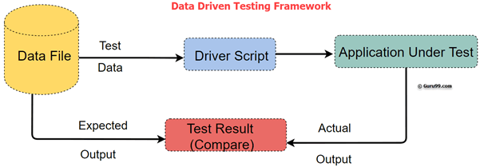
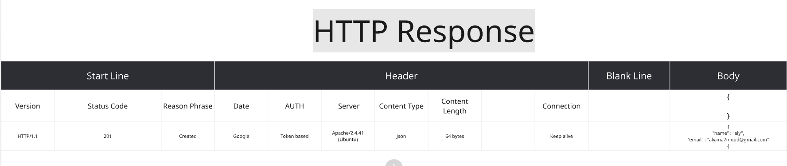

# Testing Course

This is Tarek Roshdy, Udemy AI generated notes, for [The Complete 2025 Software Testing Bootcamp](https://www.udemy.com/course/testerbootcamp/) 

## Roles in the Software Development Team

### Requirement Engineers

#### Introduction

Before discussing software testing, it is essential to understand the roles within a software development team. As a software tester, you do not work in isolation—you receive input from other team members and provide output to them. Understanding their responsibilities and the relationships between roles ensures efficient collaboration.

The roles discussed follow the sequence of the software development lifecycle (SDLC), starting from the beginning of the project. The first role in this sequence is the **Requirements Engineer**.

#### Role of the Requirements Engineer

A **Requirements Engineer** gathers requirements from the client and communicates them to the development team. This role is often known by different names in companies, such as:

- **Business Analyst**
- **Product Owner**

#### Business Analyst

A **Business Analyst (BA)** focuses on analyzing business requirements and conveying them to the development team. Their responsibilities include:

- Studying the market to identify opportunities for growth and revenue.
- Writing key documentation, such as:
  - **Software Requirements Specification (SRS)**
  - **Business Requirements Document (BRD)**

#### Product Owner

A **Product Owner (PO)** is primarily part of an **Agile team**. Their role is similar to a Business Analyst but is structured within Agile methodologies. Key aspects include:

- Writing requirements in the form of **User Stories**:
  - Format: "As a [type of user], I want to [perform an action] in order to [achieve a benefit]."
  - Accompanied by **Acceptance Criteria**, which define when the story is considered complete.

#### Deliverables and Interaction with a Software Tester

##### Business Analyst Deliverables

A software tester receives the following from a Business Analyst:

- **SRS and BRD Documents**
- In smaller companies, requirements may be conveyed orally.

A software tester's responsibilities include:

- Reviewing requirements for ambiguities, inconsistencies, and incompleteness.
- Deriving **test scenarios** and **test cases** from these requirements.

##### Product Owner Deliverables

A software tester receives the **Product Backlog**, which includes all User Stories. The tester's interaction with a Product Owner is typically:

- More informal, often involving **daily meetings**.
- Direct discussions about application functionality and correctness.
- Understanding User Stories and creating test cases accordingly.

#### Summary

- A **Requirements Engineer** collects and documents requirements.
- A **Business Analyst** focuses on business needs and writes SRS/BRD documents.
- A **Product Owner** works within Agile teams and writes User Stories.
- A software tester reviews requirements, ensures clarity, and creates test scenarios and cases based on the provided documentation.

### UI/UX Designers

UI and UX designers play a crucial role in software development by designing the application's interface and improving user experience. Understanding the distinction between UI and UX is essential.

#### UI Designer Responsibilities

1. **Requirement Gathering & Review**
   - After requirements are gathered and reviewed, ambiguities are cleared.
   - Ensures everyone understands what is to be developed.
2. **Design Creation**
   - The design phase can be a single step or iterative.
   - Tools like **Figma** are commonly used to create UI designs.
   - The first step often involves creating **wireframes**, which are rough sketches of the application layout.
     - Wireframes can be drawn on paper or digitally.
     - Saves time and budget by allowing early feedback before full design implementation.
   - Once approved, the wireframe is converted into a detailed UI design.
3. **Application of UI Design**
   - UI design acts as a reference for developers.
   - Websites and applications alike follow the same design process.

#### Role of a Software Tester in UI/UX

1. **Design Review & Feedback**
   - Testers do not create the UI design but are responsible for reviewing it.
   - Testers analyze:
     - Layout issues (e.g., misalignment of elements).
     - Accessibility concerns (e.g., color contrast for users with poor eyesight).
     - Logical flow (e.g., correct ordering of tasks).
   - Provides feedback to UI designers to enhance usability.
2. **Using Design for Testing**
   - Helps testers refine **test scenarios** and **test cases**.
   - If only a design is available (without formal requirements), testers create cases based on the UI.
   - If both requirements and UI design exist, testers must ensure alignment.
   - Example:
     - Initial test case: "Click on the button."
     - Improved with UI design: "Tap on the 'Add Task' button."

#### UI vs. UX

1. **UI (User Interface)**
   - The visual elements of the application (e.g., screens, buttons, layouts).
   - Created using tools like Figma.
2. **UX (User Experience)**
   - The overall interaction and satisfaction of the user.
   - Considers usability, accessibility, and efficiency.
   - Evaluates:
     - Ease of performing actions.
     - Complexity vs. simplicity based on target users (e.g., games for teenagers should be more complex).

#### UI/UX in Organizations

- Some companies have separate **UI Designers** and **UX Designers** (or usability experts).
- In many cases, a single **UI/UX Designer** handles both roles.

### Front-End, Back-End, & Mobile Developers

#### Understanding Development in the Software Lifecycle

- Development is not just about writing code; it includes requirements engineering and design creation.
- Many outside the software industry assume software development consists only of coding and testing, which is a misconception.
- Development activities include:
  - Requirements engineering
  - Design creation
  - Coding
- Software testers are involved beyond just reviewing or testing the final application.

#### Development Phases

1. **Requirements Creation**: Delivered to developers for feedback.
2. **Design Creation**: Sent to developers for implementation.
3. **Development Begins**: Involves multiple roles such as front-end, back-end, and mobile developers.

#### Key Developer Roles

##### Front-End Developer

- Responsible for implementing the UI design into interactive code.
- Works with technologies like:
  - **HTML** (Structure)
  - **CSS** (Styling)
  - **JavaScript** (Interactivity)
- Converts static designs into functional interfaces.

##### Back-End Developer

- Manages the logic and data storage behind the application.
- Responsible for:
  - Handling database operations.
  - Managing authentication and authorization.
  - Processing business logic.
- Often builds admin panels or dashboards for managing the application.
- Enables adding content (e.g., products on Amazon, courses on Udemy) that appears on the front end.
- Sometimes, the same person handles both front-end and back-end tasks, becoming a **Full-Stack Developer**.

##### Mobile Developer

- Develops applications for mobile platforms (Android & iOS).
- Works with different types of applications:
  - **Native Apps**: Developed separately for Android (Java/Kotlin) and iOS (Swift/Objective-C).
  - **Hybrid Apps**: Developed using a single codebase for both platforms.
- A more in-depth discussion is covered in the Mobile Testing section.

##### Software Testing Involvement

- Testers validate:
  - Front-end functionality after development.
  - Back-end functionality after development.
  - Integration between front-end and back-end (e.g., verifying data consistency between UI and database).
- Ensures that data actions performed in the backend reflect correctly in the front-end.

##### Summary

- Development encompasses more than just coding—it includes requirements and design.
- Front-end developers handle UI implementation.
- Back-end developers manage business logic and databases.
- Mobile developers build applications for smartphones.
- Software testers play a crucial role in verifying both individual and integrated functionalities.

### Project Manager & Scrum Master

#### Understanding Management Roles

- Software projects require structured management to coordinate tasks between different team members.
- Management roles vary based on company hierarchy and project methodology.
- The two main management roles are:
  - **Project Manager**
  - **Scrum Master**

#### Project Manager

- A traditional project manager responsible for overall team coordination.
- Often has a software background and manages schedules and deliverables.
- Responsibilities include:
  - Determining software delivery timelines for testers.
  - Allocating time for software testing before deployment.
  - Ensuring software is ready for production or release.

#### Scrum Master

- Applies to Agile teams, which are typically small (3-9 members).
- Acts as a team leader rather than a direct manager.
- Responsibilities include:
  - Motivating and guiding the team towards goals.
  - Supporting developers, product owners, and testers.
  - Facilitating Agile processes within the team.

#### Additional Roles in Software Development

- Companies may have other specialized roles, including:
  - **Data Scientist**
  - **Database Administrator**
  - **AI/Machine Learning Engineer**
  - **Big Data Engineer**
  - **DevOps Engineer**
  - **Ethical Hacker/Penetration Tester**
  - **Cloud Engineer**
- These roles support software development and infrastructure management.

#### Summary

- Development encompasses more than just coding—it includes requirements and design.
- Front-end developers handle UI implementation.
- Back-end developers manage business logic and databases.
- Mobile developers build applications for smartphones.
- Project managers coordinate development activities.
- Scrum masters facilitate Agile team processes.
- Software testers review and validate work across all roles.
- Additional specialized roles exist depending on company needs.

The next section will explore further aspects of software testing.

## Test Scenario Writing (Beginner)

### Creating Test Scenarios

Like we discussed in the previous section, from this video, we will begin our practical testing activities. The first activity that we are going to do is test scenario writing or test condition writing. This is the first step that you, as a software tester, will work on in any project that you are assigned to.

#### What is a Test Scenario?

Imagine that you joined a new project, the requirements are written, and then you are delivered those requirements. Your role is to review those requirements. As we discussed, reviewing the requirements is a static test activity. You review the requirements and understand them. Now, you need to prepare for dynamic testing.

The first step is to review the requirements and begin to generate test scenarios from them. The test scenarios are executed to identify and find defects in the software.

**A test scenario** is defined as any functionality that can be tested. Sometimes, it is called a **test condition** or **test possibility**. Some resources differentiate between a test scenario and a test condition, while others consider them the same. Since we are still beginning our learning journey in software testing, we will consider test scenarios and test conditions as the same.

Writing test scenarios or test conditions happens in the test analysis phase, which is the third step of the test process.

#### End-User Perspective in Test Scenarios

As a tester, you should put yourself in the end-user’s shoes. You need to think about:

- The functionalities and scenarios that the end-user will go through while using the application.
- The mistakes a user might make while using the application.
- Real-world scenarios and use cases of the application under test.
- High-risk functionalities where defects could lead to significant monetary or effort loss.

#### How to Create a Test Scenario

These are the main steps you can follow to write or identify your test scenarios:

1. **Study the Business Documents**
   - Review documents such as the Business Requirements Document (BRD), Software Requirements Specification (SRS), Functional Requirements Specification (FRS), user stories, use cases, and acceptance criteria.
2. **Isolate Every Requirement**
   - Identify functionalities like login, sign-up, cart management, etc.
3. **Identify Possible User Actions**
   - Determine the interactions a user can have with the application.
4. **Consider Technical Issues**
   - Think about potential problems associated with each requirement.
5. **Analyze System Abuse Scenarios**
   - Consider scenarios where hackers or malicious users might attempt to break the system.
6. **Write the Test Scenarios**
   - Enumerate test scenarios for each functionality or requirement.
   - Experience plays a role in deciding which scenarios are critical and which are less important.
   - Ensure your scenarios cover every valid and feasible user flow of the application or website.
7. **Traceability and Requirement Mapping**
   - Maintain bidirectional traceability between scenarios and requirements.
   - If requirements change in the future, you can identify which scenarios need updates.
   - If a test scenario fails, comparing it with the requirement helps determine if it is a defect.
8. **Review and Prioritize Scenarios**
   - Get stakeholders or senior testers to review scenarios for coverage, consistency, and validity.
   - Assign priority levels to test scenarios based on project needs.
   - Prioritization is essential when there is limited time for execution.
9. **Scenario Execution Strategy**
   - Depending on the project phase, decide which test scenarios to execute.
   - For instance, smoke testing may require running only specific scenarios, while regression testing involves running a broader set of tests.

By following these steps, you can systematically create and manage test scenarios, ensuring comprehensive coverage of the software under test.


### Tools to Help in Creating Test Scenarios

#### Using Google to Find Test Scenarios

The first resource is Google. For example, if you have an e-commerce website that needs testing, you can search for:

> "test scenarios for an e-commerce website."

You will find many resources that give you examples of scenarios relevant to what you are testing.

For example:

- **15 critical test cases for e-commerce websites** (even though some resources use "test cases," we are focusing on test scenarios here).
- Scenarios covering login/registration, payment gateway, product search, add to cart, etc.
- Each section provides multiple ideas on how to test specific functionalities.

Other websites may also provide test cases for login in platforms like Amazon. These are generally **test scenarios** rather than **test cases**, as they consist of **single-statement descriptions.**

Examples:

- **Test valid username and password**
- **Test 'Forgot Password' functionality**
- **Validate if the user is registered or not**

When using Google for scenarios, always compare them to your application. For instance, if a scenario mentions a "Forgot Password" link but your application does not include it, do not blindly copy it. Instead, generate your own scenarios based on the ideas presented.

If your application is complex or innovative (e.g., a medical application, a new game, or a social media platform with a unique idea), you may not find guidance online and will need to create test scenarios from scratch.

#### Using AI Tools Like ChatGPT for Test Scenarios

Another useful tool is **ChatGPT**. It can generate test scenarios based on provided functionality details.

Example prompt:

> "I have a login/sign-up functionality with four required fields (name, email, phone number, username) and two optional fields (address, country). Can you create test scenarios for it?"

**ChatGPT** will generate numerous scenarios, such as:

- **Handling empty fields**
- **Validating email format**
- **Checking username constraints**

You can refine the request further:

> "The username must be alphanumeric, between 5 and 20 characters. Can you create scenarios for this?"

**ChatGPT** will then focus on this specific requirement, generating scenarios for minimum and maximum lengths, invalid characters, and more.

#### The Role of a Software Tester

While AI can generate many scenarios, your role as a tester is to **select the most relevant ones**. In real projects, time constraints mean you cannot test every possible scenario.

For example, testing username lengths:

- **Minimum length: 5 characters**
- **Less than minimum: 4 characters**
- **Maximum length: 20 characters**
- **More than maximum: 21 characters**

This approach follows **Boundary Value Analysis (BVA),** which will be explained later. Whether testing at boundaries is critical depends on the application. If it's important to enforce character limits strictly, you should test these cases. If not, testing them may not be necessary as it consumes additional time.

Thus, AI tools and online resources can provide **guidance**, but finalizing test scenarios requires **human judgment and prioritization** based on the application and project constraints.

### Trello

​	Try to make a Trello account and use Kanban, scrum template.

### Facebook Login/Sign-up Testing

[Facebook Card](https://trello.com/b/O2w819Eq/aly)

### [Udemy Website Search](https://trello.com/b/O2w819Eq/aly)

## Black-Box Test Techniques

### Introduction

Welcome back.

In this section, we will discuss the Black-Box Test Techniques. As mentioned earlier, these techniques are used in **analysis** and **design** to help generate the best data for achieving the highest coverage of an application during these activities.

#### What is Black-Box Testing?

**Black-Box Testing** was previously discussed in the first section of this course under testing types. There are two main types of testing:

- **Black-Box Testing**: The tester provides input to the system and waits for the output without knowing the internal structure of the system.
- **White-Box Testing**: The tester provides input while having access to the internal structure of the system and then observes the output.

At a later stage, when discussing coding, White-Box Testing will be covered in detail. Additionally, there is **Gray-Box Testing**, which provides partial access to the system.

Examples of Gray-Box Testing include:

- **API Testing**
- **Database Testing**

Some people categorize these as White-Box Testing because they provide access to system components, while others classify them as Gray-Box Testing because they allow interaction with internal structures like APIs or databases without direct access to the code.

#### Application of Black-Box Test Techniques

Black-Box Test Techniques are primarily applied in:

- **System Testing**
- **Acceptance Testing**

As a software tester, your role includes:

- Understanding these techniques
- Applying them in appropriate scenarios

#### Example: Testing a Calculator Application

In Black-Box Testing:

1. The tester specifies the input.
2. During test execution, the tester provides input and waits for the output.
3. The tester does not know how the application processes the input (e.g., whether it treats numbers as integers or floats, how variables are named, or how methods operate internally).
4. If the output matches expectations, the system is functioning correctly; otherwise, there is a defect.

*Example test cases:*

- `2 + 3 = 5`
- `3 * 3 = 9`
- `10 * 0 = 0`
- `99,999 * 1 = 99,999`

Since **Black-Box Testing** focuses solely on **input-output behavior**, it is sometimes referred to as **behavioral-based testing**. The tester does not concern themselves with internal system operations, as this is the developer’s responsibility.

#### Five Main Black-Box Test Techniques

1. **Equivalence Partitioning**
   - Divides the system into partitions where each partition behaves similarly.
2. **Boundary Value Analysis**
   - Extends equivalence partitioning by focusing on boundary values.
3. **Decision Table Testing**
   - Used when multiple inputs affect the system’s response.
   - Example: A form with multiple questions where different combinations of answers yield different outcomes.
4. **State Transition Testing**
   - Used for complex systems with defined state changes (e.g., Sign Up → Login → Payment).
   - Common in hardware systems such as embedded systems or coffee machines.
5. **Pairwise Testing**
   - Used when there are multiple input combinations.
   - Example: Filtering results in a search engine.
   - Helps determine which input combinations should be tested and which can be skipped.

Each of these techniques is designed for specific scenarios and has its own application method. In the following videos, each technique will be explored in greater detail with real-life examples.

### Black-Test techniques Types

#### Equivalence Partitioning

**Introduction**

**Equivalence partitioning** is a **black-box testing** technique that helps reduce the number of test cases while maintaining good test coverage. Instead of testing at arbitrary times, equivalence partitioning ensures that each distinct partition of input data is tested at least once.

**Example Scenario**

Imagine you are planning your day with a structured schedule:

- **5:00 PM - 7:00 PM**: Studying software testing

- **7:00 PM - 9:00 PM**: Break

- **9:00 PM - 11:00 PM**: Studying again

- **11:00 PM onwards**: Sleeping

- **9:00 AM - 3:00 PM**: Working as a full-time tester

- **3:00 PM - 5:00 PM**: Social media and personal time

  

Now, suppose your friend is responsible for checking whether you are following your schedule. They may randomly check at different times:

- At **10:00 AM**, they ask if you are working.
- At **4:00 PM**, they ask if you are on social media.
- At **6:00 PM**, they check if you are studying.
- Similarly, they check at different intervals during other activities.

**Problem with Random Testing**

If we check multiple times within the same period (e.g., checking at **5:00 PM, 5:10 PM, 5:15 PM, etc.**), we are only verifying the "studying" partition multiple times while neglecting other partitions like "work" or "break."

**Concept of Equivalence Partitioning**

Each activity (work, social media, studying, break, and sleep) represents a **partition**. Instead of randomly selecting test cases, equivalence partitioning ensures that we test **one case per partition**:

| Partition    | Test Case (Example Time) |
| ------------ | ------------------------ |
| Work         | 11:00 AM                 |
| Social Media | 4:00 PM                  |
| Study 1      | 5:30 PM                  |
| Break        | 8:00 PM                  |
| Study 2      | 10:00 PM                 |
| Sleep        | 12:00 AM                 |

This approach provides **100% equivalence partitioning coverage** with only **six test cases**, instead of redundant tests.

**Application of Equivalence Partitioning**

Equivalence partitioning can be applied to any system where inputs can be grouped into partitions, such as:

- Time-based schedules
- Pricing categories
- Tax calculations
- Measurements like length, width, or currency
- Amount of money transactions

If a partition is not tested, it means there is a **gap in test coverage**, which could lead to missed defects in the system.

**Identifying Partitions**

Partitions can be determined in different ways:

1. **Intuitively**: Based on experience and logical classification.
2. **Explicitly Defined**: Mentioned in user stories, use cases, or business requirement documents.
3. **Consultation**: If partitions are unclear, they should be discussed with the **product owner**, **business analyst**, or **client** to validate correctness.

##### Equivalence Partitioning Examples  

###### Example 1: Grading System  
- A machine assigns grades based on scores:  
  - 1-49 → F  
  - 50-59 → D  
  - 60-69 → D+  
  - 70-79 → C  
  - 80-89 → B  
  - 90-100 → A  
- **Partitions:**  
  - Valid: (1-49), (50-59), (60-69), (70-79), (80-89), (90-100)  
  - Invalid: (<1), (>100)  
- **Test Cases (One per partition):**  
  - 25, 55, 62, 77, 81, 99, -5, 110  

###### Example 2: Age Validation  
- Signup form with age conditions:  
  - <13 → Error: "Too young"  
  - 13-100 → Welcome message  
  - Invalid → Error: "Enter a valid value"  
- **Partitions:**  
  - Valid: (13-100)  
  - Invalid: (<0), (>100), (Non-numeric)  
- **Test Cases:**  
  - 10, 25, -3, 150, "abc"  

**Note:** Invalid inputs can be multiple partitions if they produce different outputs.

**Conclusion**

Equivalence partitioning helps streamline testing efforts by ensuring each functional area of a system is adequately covered with minimal test cases. If partitions are not properly identified and tested, there may be issues in requirement coverage, leading to undetected errors in the system.

#### Boundary Value Analysis

**Introduction**

- Boundary-value analysis is an extension of equivalence partitioning.
- If equivalence partitioning is applied, boundary-value analysis should also be considered.

**When to Choose Boundary-Value Analysis vs. Equivalence Partitioning**

- **Equivalence Partitioning**
  - Simpler method.
  - Lower coverage.
  - Used when the system is simple and defects have a low impact.
- **Boundary-Value Analysis**
  - More complex but has higher failure detection probability.
  - Used when the system is complex and defects have a high impact.
  - Requires clear partition boundaries.

**Importance of Boundaries**

- Some systems do not have strict boundaries, **e.g.**, a study schedule where studying can end at 6:59 or 7:01 without significant consequences.
- Other systems have strict boundaries, e.g., speed limits where 120 km/h incurs no fine, but 121 km/h does.

**Example of Boundary-Value Analysis**

- Consider a system operating between **5:00 PM and 7:00 PM**.
  - **Equivalence Partitioning**: Testing at 6:00 PM, 5:30 PM, or 6:30 PM is acceptable.
  - **Boundary-Value Analysis**:
    - Test at exact boundaries: **5:00 PM and 7:00 PM**.
    - Test values just outside the boundary: **4:59 PM and 7:01 PM**.
    - Ensures coverage of transition points between partitions.

**Boundary Test Values**

- For each boundary:
  - Test the **last value** from the first partition.
  - Test the **first value** of the second partition.
- Example:
  - Boundary at 5:00 PM → Test **4:59 PM** (previous partition) and **5:00 PM** (current partition).
  - Boundary at 7:00 PM → Test **6:59 PM** (current partition) and **7:00 PM** (next partition).

**Variations of Boundary-Value Analysis**

- **Two-Value Boundary Analysis**
  - Preferred method.
  - Tests the two critical boundary values (last of the previous partition and first of the next partition).
- **Three-Value Boundary Analysis** (Skipped as it is not deemed essential).
  

**Common Developer Mistakes at Boundaries**

- Miswriting conditional statements:

  - Forgetting "equal to" in conditions.
  - Using "greater than" instead of "greater than or equal to".

- Duplicating boundary values in multiple conditions:

  ```
  if (x >= 5) {
      // Do something
  } else if (x <= 5) {
      // Do something else
  }
  ```

  - Here, `5` appears in both conditions, leading to potential logic errors.

##### Boundary Value Analysis Example

- Boundary-value analysis applies to systems with well-defined partitions.
- Instead of testing any value within a partition, test the first and last values.
- Example: Exam grading system.

###### Example 1: Grading System Partitions


**Test Cases**

- Boundary values for each partition:
  - **F → D-**: 49, 50
  - **D- → D**: 59, 60
  - **D → C**: 69, 70
  - **C → B**: 79, 80
  - **B → A**: 89, 90
  - **A (Max value)**: 100
  - **Invalid Partitions**:
    - Below valid range: 0
    - Above valid range: 101

**Key Points**

- 14 test cases compared to ~7 in equivalence partitioning.
- More complex but ensures better defect detection.
- Decision to use depends on system complexity and requirement clarity

###### Example 2: Age validation Registration System

- `< 13`: Too young
- `13-100`: Welcome message
- `> 100`: Invalid

**Test Cases:**

| Input Type | Test Value | Expected Result | Test Validity Type |
| ---------- | ---------- | --------------- | ------------------ |
| Age        | 12         | Too young       | Invalid            |
| Age        | 13         | Welcome message | Valid              |
| Age        | 100        | Welcome message | Valid              |
| Age        | 101        | Invalid         | Invalid            |

- If input is month and year of birth (testing in Jan 2020):
  - Test **Jan 2007 (valid)** and **Feb 2007 (invalid)**.
- If input is exact date of birth:
  - Test **5th Jan 2007 (valid)** and **6th Jan 2007 (invalid)**.
- Leap year case (29th Feb 2020):
  - Test **28th Feb 2007 (valid)** and **1st March 2007 (invalid)**.

**Conclusion**

- Boundary-value analysis is critical for systems with strict partitions.
- Helps uncover defects at transition points where developers commonly make errors.

#### Notes About Equivalence Partitioning & Boundary-Value Analysis

**Partitioning Rules**

- Each value belongs **only** to one partition.
- A value **cannot** belong to two partitions simultaneously.
- If ambiguity exists, consult the product owner or business analyst.

**Applicability**

- Both **Equivalence Partitioning (EP)** and **Boundary-Value Analysis (BVA)** can be applied to:
  - **Input values**: Partitions exist in the input domain.
  - **Output values**: Partitions exist in the output domain.
- **Example:**
  - **Input-based partitioning**: Grades (A, B, C) based on input values.
  - **Output-based partitioning**: A system categorizes values into partitions after processing.

**Valid vs. Invalid Partitions**

- Always consider both **valid** and **invalid** partitions.
- Questions to ask:
  - Where are the **valid partitions**?
  - Where are the **invalid partitions**?
  - Is it possible to test **invalid partitions**?
  - How does the system handle errors in invalid partitions?

**Coverage Measurement**

- **Equivalence Partitioning Coverage**:
  - Formula: `(Covered Partitions / Total Partitions) * 100%`
  - Goal: Achieve **100% partition coverage**.
- **Boundary-Value Analysis Coverage**:
  - Count **all covered boundaries**.
  - Each boundary consists of **two values**:
    - The **last value** of the first partition.
    - The **first value** of the second partition.
  - Formula: `(Covered Boundaries / Total Boundaries) * 100%`
  - Goal: Achieve **100% boundary coverage**.

**Testing Strategy**

- **Testing multiple values from the same partition does not increase coverage**.
- In **Equivalence Partitioning**:
  - Only **one representative value** per partition is needed.
- In **Boundary-Value Analysis**:
  - Test **two values** per boundary:
    - First value of the partition.
    - Last value of the partition.

**Abbreviations**

- **EP** = Equivalence Partitioning
- **BVA** = Boundary-Value Analysis
- Commonly used in job assessments, interviews, and technical documentation.

#### Decision Table Testing

**Overview**

Decision Table Testing is a black-box test design technique used when multiple conditions influence different outcomes. It is particularly useful when dealing with complex business rules.

**When to Use Decision Table Testing**

- When there are multiple conditions affecting system behavior.
- When requirements are presented in tabular format.
- When test coverage must be maximized efficiently.

**Example Scenario**

Consider a discount system where:

1. A customer must purchase items worth more than 100 USD.
2. The customer must have a Gold Subscription.

These two conditions determine whether a discount is applied.

**Structure of a Decision Table**

A decision table consists of:

- **Conditions (Inputs):** Factors affecting the outcome.
- **Actions (Outputs):** The system's response.
- **Rules:** Unique combinations of conditions leading to specific actions.

| More than 100 USD | Gold Subscription | Discount Applied |
| ----------------- | ----------------- | ---------------- |
| True              | True              | Yes              |
| True              | False             | No               |
| False             | True              | No               |
| False             | False             | No               |

**Formula for Calculating Test Cases**

The number of test cases required for full coverage follows:

**Where:**

- **X** = Number of possible values per condition (e.g., 2 for True/False, 3 for Yes/No/Maybe)
- **N** = Number of conditions

**Example:**

- If there are **3 conditions** with **2 values each**, the number of test cases is: 2^3 =8
- If there are **2 conditions** with **3 values each**, the number of test cases is: 3^2 =9

**Optimizing Decision Tables**

- **Minimization:** Remove redundant test cases where multiple combinations yield the same result.
- **Equivalence Partitioning:** Group similar inputs to reduce test cases.
- **Boundary Value Analysis:** Test around key threshold values.

**Practical Considerations**

- Some systems have too many possible conditions to achieve full test coverage.
- Decision Table Testing can be combined with other techniques for efficiency.
- Requirements may be presented as tables in documentation (e.g., SRS, BRD, use cases, user story).
- If requirements are in text form, converting them into a decision table can clarify expected behaviors.

**Limitations**

- **Scalability Issues:** A large number of conditions exponentially increases test cases.
- **Alternative Techniques:** In some cases, Equivalence Partitioning or Boundary Value Analysis may be better suited.

**Example – Exam Scoring System**

An exam has **40 questions**, each with **4 possible answers**. To cover all possible combinations:

 (Over a trillion test cases – impractical!)

**Instead, we simplify:**

- Students scoring **≥ 65%** pass.
- Students scoring **< 65%** fail.
- We can use Equivalence Partitioning and Boundary Value Analysis to test around the **65% cutoff**.

##### Decision Table Testing Example

**Overview**

This example demonstrates decision table testing applied to a **speeding fine system**. The goal is to achieve **100% test coverage** by selecting appropriate test cases.

**Decision Table Structure**

The system has two conditions:

1. **Speed > 50?** (Yes/No)
2. **Is this a school zone?** (Yes/No)

Based on these conditions, we derive four possible rules:

| Rule | Speed > 50 | School Zone | Action     |
| ---- | ---------- | ----------- | ---------- |
| R1   | Yes        | Yes         | Go to Jail |
| R2   | Yes        | No          | Pay a Fine |
| R3   | No         | Yes         | No Action  |
| R4   | No         | No          | No Action  |

**Existing Test Cases**

Two test cases are already designed:

- **R1:** (Speed > 50, School Zone) → **Go to Jail**
- **R4:** (Speed ≤ 50, Not School Zone) → **No Action**

**Additional Test Cases**

The system provides four additional test cases:

| Test Case | Speed | School Zone | Covered Rule?  |
| --------- | ----- | ----------- | -------------- |
| DT1       | 55    | Yes         | Duplicate (R1) |
| DT2       | 44    | Yes         | Covers R3      |
| DT3       | 66    | Yes         | Duplicate (R1) |
| DT4       | 77    | No          | Covers R2      |

**Achieving 100% Coverage**

To achieve full coverage, we need test cases for:

- **True, False** (Speed > 50, Not a School Zone) → **Pay a Fine** (Covered by DT4)
- **False, True** (Speed ≤ 50, School Zone) → **No Action** (Covered by DT2)

**Final Test Set for 100% Coverage:**

- **R1 (Existing)** → Speed > 50, School Zone → **Go to Jail**
- **R4 (Existing)** → Speed ≤ 50, Not School Zone → **No Action**
- **DT2 (New)** → Speed ≤ 50, School Zone → **No Action**
- **DT4 (New)** → Speed > 50, Not School Zone → **Pay a Fine**

**Key Takeaways**

- Decision tables help visualize test case coverage.
- Existing test cases may provide **incomplete coverage**.
- Additional test cases can be selected **systematically** to ensure **full decision table coverage**.
- In real-life scenarios, test cases may exist in a **test suite**, requiring testers to **analyze and optimize** coverage without always drawing a table.

**Conclusion**
Decision Table Testing is a powerful technique for handling complex logical conditions but must be used wisely to ensure feasibility. In cases where exhaustive testing is impractical, optimization techniques help achieve effective coverage.

#### State Transition Testing

**Definition**

State-transition testing is a black-box testing technique that involves defining states and transitions in a system.

**States and Transitions**

Each **state** is a condition in which the system can rest. Transitions occur when the system moves from one state to another.

**Example: An ATM machine**

1. The system asks the user to enter a **PIN number**.

2. If the PIN is **correct**, the system transitions to the **profile page**.

3. If the PIN is **incorrect**, the system prompts for re-entry.

4. After three incorrect attempts, the **card is ejected or retained**.

   

   

**Coverage Criteria**

1. **State Coverage:** Ensuring all states are tested.
2. **Transition Coverage:** Ensuring all transitions between states are tested.

**State Coverage**

- The minimum coverage criterion.
- Covers all possible states in the system.
- Example: Test cases ensure all states like "Enter PIN", "Profile Page", and "Card Retained" are reached.

**Transition Coverage**

- More comprehensive than state coverage.
- Covers all possible transitions between states.
- Example: If there are **five states** and **six transitions**, all six transitions must be tested.
- Ensures implicit state coverage.

**Example of Transition Coverage**

- A test case can transition directly from "Enter PIN" to "Profile Page" (1 → 5).
- Another test case transitions through incorrect attempts (1 → 2 → 3 → 4 → Eat Card).
- Additional test cases are needed to cover all transitions (A, B, C, D, E, F).
- **Dead States:** States with incoming transitions but no outgoing transitions (e.g., "Profile Page", "Card Retained").

**Test Case Design for Coverage**

1. **State Coverage:** Requires two test cases:
   - One going directly to the profile page.
   - One failing three times and resulting in card retention.
2. **Transition Coverage:** Requires four test cases:
   - Ensuring all paths (correct and incorrect attempts) are covered.
   - Covering all transitions A, B, C, D, E, and F.

**Key Takeaways**

- **Start State:** The initial system state.
- **Dead States:** No further transitions possible.
- **State Coverage vs. Transition Coverage:**
  - State coverage requires fewer test cases.
  - Transition coverage ensures more detailed testing.
- Some systems may have **infinite loops** with no fixed start state.
- **More advanced coverage techniques exist**, but state and transition coverage are fundamental for beginners.

**Simple Example**

- **States:** On, Off.
- **Transitions:** On → Off, Off → On.
- Each transition represents a state change, requiring test coverage.

#### PairWise Testing

**What is Pairwise Testing?**

Pairwise testing is a technique applied in specific cases inside websites or applications. For instance, consider a form with three fields, each containing multiple options or values. Testing all possible combinations would be impractical due to time constraints and low return on investment.

Pairwise testing helps achieve sufficient test coverage with fewer test cases. The goal is to ensure that each pair of values appears together in at least one test case.

**Example Scenario**

Consider Udemy's filtering options:

- **Ratings**: 4.5 and up, 4 and up, 3.5 and up, 3 and up (4 choices)
- **Video Duration**: 0-1 hour, 1-3 hours, 3-6 hours, 6-17 hours, 17+ hours (5 choices)
- **Level**: All levels, Beginner, Intermediate, Expert (4 choices)

To test each filter separately:

- Ratings: 4 test cases
- Video Duration: 5 test cases
- Level: 4 test cases

This results in **13 test cases** but does not cover combinations. Testing all possible combinations would require:

 test cases, which is excessive.

**Applying Pairwise Testing**

Pairwise testing ensures that each pair of values appears together **at least once** in a test case, minimizing the total number of test cases required while maintaining effective coverage.

**For example:**

- One test case might include "4.5 and up" with "0-1 hour" and "All levels."
- Another test case might include "4.5 and up" with "0-1 hour" and "Beginner."
- Another test case might include "0-1 hour" with "All levels."

However, there is no guarantee that all values will appear in a single test case.

**Generating Pairwise Test Cases**

Creating test cases manually for pairwise testing can be complex. Instead, tools can generate optimized test cases efficiently. One such tool is:

[Pairwise Testing Tool 1](https://pairwise.yuuniworks.com)
[Pairwise Testing Tool 2](https://pairwise.teremokgames.com/)

**Steps to Generate Pairwise Test Cases:**

1. Open the tool.
2. Define input variables and their possible values.
3. Set constraints if necessary (e.g., "Expert level requires at least 3 hours of content").
4. Click "Generate" to get the optimized test cases.

**Benefits of Pairwise Testing**

- Reduces the number of test cases significantly.
- Ensures critical combinations are tested.
- Saves time while maintaining effective test coverage.
- Avoids redundancy and unnecessary test efforts.

By applying pairwise testing, testers can efficiently validate system behavior without exhaustive combinatorial testing, making it an essential black box testing technique.

#### Summary

**Black Box Testing Techniques**

- Equivalence partitioning
- Boundary value analysis
- Decision table testing
- State transition testing
- Pairwise testing

**Skills Acquired**

- Writing test scenarios
- Applying black box testing techniques

**Application of Techniques**

- When writing test scenarios and test cases
- During exploratory testing to find defects
- In advanced testing topics like ABI testing, performance, and automation
- Always consider which technique is suitable for each test scenario

**Gaining Expertise**

- Experience helps in identifying the best techniques for different systems
- Continued practice improves testing skill


## Testing Case Writing [Beginner]

### How to Write a Test Case

In this section, we will begin talking about how to write a test case. We will start by identifying what a test case is, why we write it, and then explore how it is written. After this, we will use a testing tool to write our test cases.

Test case writing is one of the most important skills for a software tester. Most testing projects include writing test cases. Sometimes, we create test cases from test scenarios.

- **Step 1:** Write test scenarios (as done in the previous section).
- **Step 2:** Write test cases directly without writing test scenarios.

### Types of Testing Projects

There are three types of projects regarding test cases:

1. Some projects write only test scenarios and execute them.
2. Some projects write only test cases and execute them.
3. Some projects start with test scenarios and clarify them with test cases.

The decision to use scenarios, test cases, or both is made by test managers based on experience and project needs.

### Understanding Test Cases

A **test case** is a document that includes:

- Preconditions
- Inputs
- Actions
- Expected results


#### Differences Between Test Case and Test Scenario

- **Test Scenario:** A one-line condition (e.g., "Verify login").
- **Test Case:** A detailed document with multiple fields.

If time is limited, writing test scenarios might be preferable. If the project has high risks, writing test cases is more beneficial.

#### Components of a Test Case

##### 1. Title

- Should be **unique**.
- Should not be **too long** (e.g., three lines) or **too brief** (e.g., "Verify login").

##### 2. Preconditions

- Important for setting up the test environment.
- Example: "User is already registered using valid credentials."
- Can include multiple conditions like:
  - Internet connection availability
  - Browser updates
- Some test suites share a common precondition for all test cases.

##### 3. Test Steps

- Steps to execute the test case.
- Essential for complex systems.
- Should follow a **consistent format**:
  - **Second-person format:** "Enter a valid username."
  - **Third-person format:** "The user enters a valid username."
- Should not include preconditions in steps.
- Recommended range: **2 to 9 steps**.

##### 4. Expected Result

- Defines the expected behavior of the system.
- Example: "User is redirected to the homepage after successful login."
- Can vary based on business decisions (e.g., redirection to a dashboard, newsfeed, inbox, etc.).

##### 5. Test Suite

- A collection of related test cases.
- Names vary based on the testing tool:
  - **Test Suite**
  - **Test Folder**
  - **Feature**
  - **Condition**
- Example: A "Login" test suite contains test cases related to login functionality.

##### 6. Test Environment

- Specifies where the test will be executed.
- Critical for cross-platform applications.
- Example:
  - "Executed on Windows and Mac."
  - "Executed on mobile devices (**4G, 5G**)."

This structured approach ensures clarity and consistency in writing test cases, making them effective and manageable in a testing environment.

##### 7. Actual Result

Never fill the actual result field until you execute your test case.

##### 8. Status

Pass, Fail,  Blocked, Skipped, etc.

##### 9.Priority

##### 10.Defect Reporting 

* If discrepancies exist, they are documented and reported.

**Example** 
**Test Case: Verify Successful Login**

| **Component**        | **Description**                                              |
| -------------------- | ------------------------------------------------------------ |
| **Test Case ID**     | TC-001                                                       |
| **Title**            | Verify Successful Login with Valid Credentials               |
| **Priority**         | High                                                         |
| **Preconditions**    | - User is already registered.<br>- Internet connection is available.<br>- Browser is updated to the latest version. |
| **Test Steps**       | 1.1 Open the login page.<br>1.2 Enter a valid username.<br>1.3 Enter a valid password.<br>1.4 Click on the "Login" button. |
| **Expected Result**  | - User is redirected to the homepage.<br>- A success message is displayed. |
| **Test Suite**       | Login Functionality                                          |
| **Test Environment** | - Windows 11, macOS Ventura.<br>- Chrome (latest), Firefox (latest).<br>- Mobile (Android 13, iOS 17) under Wi-Fi and 4G. |
| **Actual Result**    | _(To be filled after execution)_                             |
| **Status**           | _(Pass, Fail, Blocked, Skipped, etc.)_                       |
| **Defect Reporting** | If discrepancies exist, they are documented and reported.    |

**Notice two things in your test case:**

1. **High-Level vs Low-Level Test Cases**
   - **High-Level Test Cases**:
     - Focus on overall functionality without specifying test data.
     - Suitable for experienced testers.
     - Provides better system coverage.
   - **Low-Level Test Cases**:
     - Includes specific data values.
     - Useful for critical systems and inexperienced testers.
2. **Concise vs Detailed Test Steps**
   - Depending on project needs, test steps can be:
     - **Detailed**: Each step is explicitly listed.
     - **Concise**: Grouping steps into general instructions.
   - The choice depends on the complexity of the system and team experience.

By following this structured approach, test cases become more organized, traceable, and effective in ensuring software quality.

[Tarek Roshdy test case register](https://docs.google.com/spreadsheets/d/1DDWOfdn40_3l4joDKN6w73TdEl-JwTdKwHoDRyZ9gMc/edit?gid=509497296#gid=509497296)

## Test Case Writing using Zephyr Scale

**Note:**
**Gherkin Script:**

```gherkin
Given:
When:
Then:
And:
```

[Add Zypher application to your Kanban Jira template and play with it](https://www.atlassian.com/software/jira)

## Data driven testing



## Test Execution & Bug Reporting [ Beginner ]  

### Introduction to Defect Reporting  

Defect reporting is a crucial skill for software testers for two main reasons:  

1. **Primary Documentation** – In many projects, testers use **exploratory testing** instead of writing test cases, making defect reports the first and sometimes the only documentation.  
2. **Cross-Team Communication** – Defect reports are shared with developers, so they must be clear and detailed to avoid miscommunication and ensure reproducibility.  

### Defect Report Writing

#### What is a Defect Report?

A defect report is a documentation of the occurrence, nature, and status of a defect in an application. It records the details of a problem that causes a difference between expected and actual results. The defect itself is the problem, also referred to as a bug or fault, while the defect report documents and communicates this problem.

#### Importance of a Defect Report

A defect report does not always confirm the existence of a defect. It could arise due to a tester's mistake, an issue in the test environment, or an intended system behavior. Hence, proper documentation is necessary for validation.

#### Components of a Defect/Bug/Fault Report

##### 1. Defect Report Title

- Should be descriptive yet concise.

- Must clearly convey the nature of the defect.

- Avoid vague titles like *Problem with Login*.

  

##### 2. Steps to Reproduce

- Should be detailed, precise, and use low-level data.
- Clearly outline the actions needed to recreate the defect.
- Avoid including prerequisites like opening the browser or turning on the internet.
- Example:
  1. Open `someacademy.com`.
  2. Click on the hamburger icon.
  3. Scroll to the bottom and click on *Settings*.
  4. Click on *Data Usage*.
  5. Change *Data Usage* to *Minimum Limit*.

##### 3. Expected Result

- What should happen based on the requirements or test case.
- If a test case exists, this field is copied from there.

##### 4. Actual Result

- What actually happened when executing the test steps.
- The actual result must differ from the expected result to confirm a defect.

##### 5. Test Environment

- Specifies the relevant and only relevant environment variables where the **defect** occurred.
- Includes relevant elements like:
  - Operating system (e.g., Windows 11, macOS)
  - Browser (e.g., Chrome, Firefox)
  - Hardware (e.g., Intel, HP, Asus)
  - Network type (e.g., Wi-Fi, 5G, Ethernet)
  - Server type (e.g., Development, Staging, Production)
- Example: *iPhone 11, iOS 13, 5G Network, Production Server*.

##### 6. Screenshots or Videos

- Visual proof to assist developers in reproducing the defect.
- Web application screenshots should capture the entire screen, including the URL.
- Videos should highlight clicks and interactions.
- Annotations like red rectangles should be used to highlight issues.

##### 7. Priority and Severity

- Defines the urgency of fixing the defect.
- Sometimes, priority and severity are separate fields.

By ensuring all these components are included, defect reports become more effective in facilitating the debugging and resolution process.

### Defect Report Example

A complete defect report includes the following details:

| **Field**               | **Description**                                              |
| ----------------------- | ------------------------------------------------------------ |
| **Title**               | Example - "Login Forgot Password Button Isn't Working"       |
| **Steps to Reproduce**  | 1. Click on "Login"2. Click on "Forgot Password"             |
| **Expected Result**     | The button should be clickable, and the user should be redirected to a page to enter their email. |
| **Actual Result**       | Clicking on the button has no effect.                        |
| **Environment**         | Device, operating system, and network details.               |
| **Severity/Priority**   | Example - "High"                                             |
| **Defect Type**         | Example - "Functional Defect"                                |
| **Supporting Evidence** | Screenshots or video recordings.                             |

Testers should use proper defect tracking tools rather than informal methods like PowerPoint or Canva for reporting defects. In the next section, we will explore how to document defects in a professional tool and assign them to team members.

### Types of Defects

#### Functional Defects

Functional defects occur when a functionality does not work as expected. For example, clicking a button that does not perform any action is considered a functional defect.


#### Visual or UI Defects

These defects are related to the user interface (UI) of the application. An example is a misaligned notification text that should appear behind an element but is instead overlapping it. The severity of UI defects can vary from critical to low priority depending on the application.


#### Content Defects

Content defects involve issues with textual content, such as duplicated sentences. For example, if a message appears twice unnecessarily, it is categorized as a content defect.


#### Performance Defects

Performance defects occur when an application is slow or unresponsive. For instance, if a video takes an unusually long time to load, it is considered a performance defect. In such cases, video recordings are often necessary to demonstrate the issue effectively, as screenshots alone cannot capture performance problems.


#### Suggestions vs. Defects

Sometimes, testers may provide improvement suggestions rather than reporting actual defects. For example, suggesting that a placeholder font should be larger is an enhancement rather than a defect unless the font is too small to be readable. If the issue significantly affects usability, it may be classified as a defect instead.

### Defect Life cycle


## Testing progress & Test summary Report

### Test Progress report:

A type of test report produced at regular intervals about the progress of test activities against a baseline, risks, and alternatives requiring a decision. Synonyms: test status report 

### Test summary report: 

A type of test report produced at completion milestones that provides an evaluation of the corresponding test items against exit criteria


## Basics of Agile & Agile Testing

**Introduction to Agile Project Management**

Agile was introduced in 2001 when a group of software engineers gathered to create the **Agile Manifesto**. Each of them had successful experiences managing teams and wanted to share best practices to improve software development globally.

The Agile Manifesto consists of:

- **Four Values**
- **Twelve Principles**

Agile methodologies like **Scrum, retrospectives, and daily standups** are based on these values and principles. Understanding them is essential for software testers, developers, and anyone involved in a software team.

### Agile 4 Values

The Agile Manifesto defines four core values:

#### 1. Individuals and Interactions over Processes and Tools

- Collaboration within the team is more important than strict adherence to tools and processes.
- Example: Instead of following a lengthy defect-reporting process, a tester may directly communicate with the developer to save time.
- However, flexibility must be approved by management.

#### 2. Working Software over Comprehensive Documentation

- Agile prioritizes delivering functional software over excessive documentation.
- Example: Instead of spending a month writing test cases and UML diagrams, creating a **minimum viable product (MVP)** allows for faster feedback and improvement.

#### 3. Customer Collaboration over Contract Negotiation

- Agile teams work **closely with customers** rather than strictly following contractual obligations.
- Example: If a client requests an adjustment outside the contract but adds value within the scope and budget, the team should accommodate it.
- Contracts serve as a **reference during conflicts** but should not hinder collaboration.

#### 4. Responding to Change over Following a Plan

- Agile encourages **adaptability** rather than rigidly following an initial project plan.
- Example: If a competitor launches a new feature, the team may adjust the development plan to remain competitive.
- Plans exist, but changes should be embraced to improve outcomes.

**Key Takeaway**

The **left-hand side** of each value is prioritized, but the right-hand side is not ignored. Agile still includes processes, documentation, contracts, and planning; however, if a conflict arises, the left-hand side takes precedence.

### Agile 12 Principles

#### 1. Satisfy the Customer

Our highest priority is to satisfy the customer through early and continuous delivery of valuable software.

- Deliver value early, for example, through an MVP.
- Continuous delivery through iterations or sprints.

#### 2. Deliver Working Software Frequently

Deliver working software on a frequent basis at intervals of between a few weeks to a few months.

- Prefer shorter iterations when possible (e.g., one-week sprints).

#### 3. Working Software is the Primary Measure of Progress

- Emphasizes working software over comprehensive documentation.
- Focus on dynamic testing rather than excessive static testing.

#### 4. Welcome Changing Requirements Even Late in Development

- Agile embraces changes for the customer’s competitive advantage.
- More changes mean more regression testing, increasing the need for test automation.

#### 5. Continuous Attention to Technical Excellence and Good Design

- Agile requires well-structured and organized code to facilitate quick changes.
- Poorly written test cases and defects hinder agility.
- Quality must be maintained even when developing at high speed.

#### 6. Agile Processes Promote Sustainable Development

- Developers, users, and sponsors should maintain a constant pace indefinitely.
- All stakeholders must have a shared understanding to prevent misalignment.

#### 7. Simplicity – The Art of Maximizing the Amount of Work Not Done

- Eliminate non-value-adding work.
- Avoid unnecessary documents or activities that do not contribute to the project's success.

#### 8. Build Projects Around Motivated Individuals

- Hire individuals with an Agile mindset.
- Provide a **supportive environment** and **trust** in the team’s capabilities.
- Reduce **micromanagement** to allow for true agility.

#### 9. The Best Architectures, Requirements, and Designs Emerge from Self-Organizing Teams

- Agile teams decide priorities and approaches without micromanagement.
- Managers should focus on higher-level strategic aspects rather than controlling daily tasks.

#### 10. Business People and Developers Must Work Together Daily Throughout the Project

- Collaboration between business representatives (e.g., product owners) and the development team.
- Daily stand-up meetings to ensure alignment.

#### 11. The Most Efficient and Effective Method of Conveying Information is Face-to-Face Conversation

- While face-to-face is ideal, remote teams must find alternatives like video meetings or continuous online communication (e.g., Discord, Slack).

#### 12. At Regular Intervals, the Team Reflects on How to Become More Effective

- Conduct retrospective meetings at the end of each iteration.
- Identify successes, issues, and improvements for future iterations.
- Testers should provide and receive feedback on testing activities.

### Difference Between Agile & Sequential Development

#### Sequential Development

- Follows a fixed set of requirements.
- Begins with writing detailed requirement documents (e.g., Software Requirement Specification - SRS, Business Requirement Document - BRD).
- Estimates effort and resources based on fixed requirements.
  - Determines the number of developers and testers required.
  - Establishes developer-to-tester ratios.
- Estimates project timeline based on unchangeable requirements.
- Common in industries where requirements cannot be altered (e.g., building bridges, airplanes, or new car models).
- Testing focuses on ensuring that fixed requirements are correctly implemented (static testing is crucial).

#### Agile Development

- Starts with fixed effort/resources instead of fixed requirements.
- The team and available resources are predefined.
- The timeline is often short and event-driven (e.g., application launch for an upcoming event in a few weeks or months).
- Requirements are estimated based on available resources and time constraints.
- Prioritizes adaptability—requirements can be adjusted throughout the process.
- Focuses on iterative development with evolving requirements.
- Testing involves user stories and acceptance criteria but allows for changes as the project progresses.

#### Key Differences

| Feature          | Sequential Development                  | Agile Development                             |
| ---------------- | --------------------------------------- | --------------------------------------------- |
| **Requirements** | Fixed                                   | Flexible                                      |
| Effort/Resources | Estimated based on needs                | Predefined                                    |
| Time Estimation  | Based on fixed requirements             | Based on available resources & time           |
| Adaptability     | Limited                                 | High                                          |
| Testing Focus    | Ensuring fixed requirements are correct | Iterative adjustments based on evolving needs |

Agile flips the traditional approach by foctusing on available resources and time first, then adapting the requirements accordingly, while sequential development fixes requirements first and estimates effort and timeline based on them.


### Whole Team Approach

The **Whole Team Approach** is a fundamental concept in agile projects, ensuring that all necessary team members collaborate to achieve project success.  

#### Team Composition  
- In agile methodologies, especially **Scrum**, testers are **not** part of an independent testing team.  
- Instead, they are integrated into the **agile team**, which includes:  
  - Developers  
  - Designers  
  - Testers (typically 1-3 per team)  
- Agile teams are **small** (recommended size: **3 to 9 members**).  
  - If teams grow beyond this size, they are often divided into **smaller sub-teams** (e.g., Scrum of Scrums).  

#### Collaboration and Communication  
- The **team should be co-located** whenever possible.  
  - If remote, communication is maintained via tools like **Slack, Discord, etc.**  
- **Quality is a shared responsibility**—not just the tester’s duty.  
  - Developers and testers should **collaborate** to enhance software quality.  
  - Developers should **not** rely on testers to catch defects; they should work together to **prevent them**.  

#### Tester’s Role in the Whole Team Approach  
- **Collaboration with Business Representatives**  
  - Work with **Product Owners** or **Business Analysts** to define **acceptance tests**.  
  - Acceptance tests should be **a joint effort**, not solely the responsibility of the tester or product owner.  

- **Collaboration with Developers**  
  - Gather input from developers when designing the **testing strategy** or **test plan**.  
  - Discuss **automation strategies** with developers instead of working in isolation.  

- **Collaboration with fellow testers**
  - Testers should **educate** the team on testing concepts (e.g., defects, test cases, requirements).  
  - Hosting **weekly knowledge-sharing sessions** can help developers improve software quality.  
  - Developers and analysts should also extend their knowledge to testers.  

#### The Power of Three  
- A key concept in the **Whole Team Approach** is the **Power of Three**, representing:  
  1. **Testers**  
  2. **Developers**  
  3. **Business Representatives** (Product Owner, Sponsor, Marketing, Business Analyst)  
- All three roles should be **involved in feature discussions** to ensure a balanced approach.  
- **Planning Poker** (an agile estimation technique) includes all three roles for better project planning.  

### Early & Frequent Feedback  

The **Early & Frequent Feedback** principle ensures that the project team continuously receives input on product quality throughout the development lifecycle.  

#### Problems in Sequential Development  
- In **sequential models** (e.g., Waterfall, V-Model), the customer **only sees the product near completion**.  
- Issues with this approach:  
  - **Lack of customer involvement** → Misalignment between expectations and the final product.  
  - **Late feedback** → Developers struggle to incorporate necessary changes.  
  - **Inflexibility** → Addressing customer concerns becomes difficult.  

#### Benefits of Agile Feedback Loops  
- **Short iterations (Sprints)** allow for **early and continuous feedback**.  
- Small **software increments** are **delivered**, allowing the customer to provide feedback regularly.  
- **Adjustments are made throughout development**, ensuring the final product aligns with expectations.  
- The customer is involved **at every step**, preventing major misunderstandings.  

#### Techniques for Rapid Feedback  
1. **Continuous Integration (CI)**  
   - Developers **push new functionality** to the system frequently.  
   - Customers and stakeholders can see changes **in real time**.  
   - Helps identify issues early in development.  

2. **Frequent Customer Feedback**  
   - Ensures that critical features receive more attention.  
   - Helps prioritize development and testing efforts **based on business value and risk**.  

3. **Agile Project Visibility**  
   - Tools like **Trello, Jira, or Kanban boards** increase transparency.  
   - Everyone can see:  
     - **What tasks are in progress** (To-Do, Doing, Done).  
     - **Team capacity** and productivity trends.  
     - **Challenges slowing down the process**.  

#### Key Benefits of Early & Frequent Feedback  
- **Avoids requirement misunderstandings**  
  - Customers clarify **unclear requirements** early, preventing costly fixes later.  
- **Ensures high-priority features are delivered first**  
  - Customer feedback helps focus on **business-critical and high-risk features**.  
- **Identifies and resolves quality issues early**  
  - Techniques like **CI/CD (Continuous Integration, Continuous Deployment)** support this.  
- **Enhances team productivity**  
  - Real-time feedback helps the agile team **adapt and improve** their workflow.  

By incorporating **early and frequent feedback**, agile teams can **deliver products that truly match customer needs** while improving efficiency and reducing risks.  

### Agile Requirements (Themes, Epics, & User Stories)

Agile requirements are crucial for software testers as they serve as the main artifact for understanding the application, building test scenarios, and creating test cases.

#### Importance of Agile Requirements

- Unlike sequential projects, where testers are not typically involved in requirements creation, agile projects follow **collaborative user story creation**.
- Testers, along with other stakeholders, participate in defining requirements.

#### Structure of Agile Requirements

Agile projects organize requirements in a hierarchical structure:

##### 1. Themes

- **Highest level** of the story hierarchy.
- Represents a **broad, tangible product** or an **abstract goal**.
- Examples:
  - Develop a new mobile application.
  - Performance tuning.
  - Improve DevOps processes.
- In some cases, a theme may be referred to as a **component**.

##### 2. Features

- **New capability** provided to the customer.
- Part of the product at a high level.
- Features belong to a theme and may contain multiple epics.
- **Terminology varies** across companies—some consider features high-level, while others treat them as low-level.

##### 3. Epics

- **Medium-sized requirement**, decomposed from a feature.
- Can take **one to two weeks of development**.
- Acts as a **container for user stories**.
- User stories within an epic share similarities (e.g., login-related user stories grouped together).
- If a feature is small, it is directly a **user story**; if large, it is an **epic**.

##### 4. User Stories

- **Smallest unit** of agile requirements.
- Represents a **single action or requirement**.
- Written in the format:
  - *As a [user role], I want to [perform an action] so that [I achieve a benefit].*
- Should be **completed within one sprint** (typically **under 20 hours**).
- If too large, it should be **split into smaller user stories**.
- **Example User Story:**
  - *As a new user, I want to be able to register so that I can access the app features.*
  - *As a premium user, I want to access exclusive content so that I get additional benefits.*

##### 5. Tasks

- **Actions required** to implement a user story.
- Includes:
  - Development tasks
  - Design tasks
  - Testing tasks (e.g., writing test automation scripts, defining acceptance criteria, performing retesting)

#### Acceptance Criteria

- Defines **conditions that must be met** for a user story to be considered complete.
- Written in the **Given-When-Then format**:
  - **Given** the user is on the registration screen,
  - **When** they fill out the form,
  - **Then** the app should allow them to submit the form.
- Each user story may have multiple acceptance criteria.

#### Key Takeaways

- **Themes** → High-level vision.
- **Features** → High-level capabilities.
- **Epics** → Medium-sized requirements, grouping related user stories.
- **User Stories** → Small, actionable requirements, completed within a sprint.
- **Tasks** → Actions required to implement user stories.
- **Acceptance Criteria** → Defines how to validate user stories.

Understanding these concepts ensures testers can **collaborate effectively**, **validate requirements**, and **build strong test cases**.


### INVEST Technique (How to Review a User Story)

The **INVEST** technique is a method used to ensure that a user story is well-written and formatted correctly. This technique can be applied by software testers or any other team members to assess user stories effectively.

The acronym **INVEST** stands for six essential elements that should be present in every user story:

- **I** - Independent
- **N** - Negotiable
- **V** - Valuable
- **E** - Estimable
- **S** - Simple or Small
- **T** - Testable

#### **1. Independent**

A user story should be **independent** and meaningful on its own. It should not rely on other user stories for comprehension. This independence ensures flexibility in development and testing, allowing stories to be rearranged as needed.

- Helps in agile projects by allowing free reordering of requirements.
- Reduces dependencies to increase flexibility.
- While dependencies may exist, they should be minimized whenever possible.

#### **2. Negotiable**

User stories should be **negotiable**, meaning they should focus on the **why** and **what** rather than the **how**.

- The story should state **why** the feature is needed and **what** needs to be developed.
- It should avoid specifying **how** the feature should be implemented.
- The technical implementation details should be left open for discussion between the development team and the client.
- Keeps user stories general enough to allow different implementation approaches.

#### **3. Valuable**

A user story should provide **value** to the user or client.

- Should contribute meaningfully to the project.
- Avoid creating stories just to increase the backlog count.
- Evaluate whether the feature truly adds value before development.

#### **4. Estimable**

A user story should be **estimable**, meaning it should provide enough information to allow an accurate effort estimation.

- Should include **clear acceptance criteria**.
- Can include additional details like **wireframes** or **field validation** to clarify expectations.
- An **ambiguous** story is **difficult** to estimate accurately.
- Ensures better sprint planning and workload management.

#### **5. Simple or Small**

A user story should be **small** and manageable within a short time frame.

- A large user story may be considered an **epic** and should be broken down.
- If a story is too big, it becomes hard to estimate and implement within a sprint.
- A good guideline: A user story should be implementable within **one day or less**.
- Breaking down large stories improves efficiency and maintainability.

#### **6. Testable**

A user story should be **testable** to verify whether it meets its intended purpose.

- Should have **clear acceptance criteria**.
- Avoid vague descriptions like *"the application should be pleasing to the eye"*.
- Instead, define testable criteria, e.g., *"The color scheme should follow accessibility standards"*.
- Ensure verifiability through acceptance tests and a **definition of done**.

By following the **INVEST** technique, teams can ensure that user stories are well-structured, clear, and effective for agile development and testing.

### Scrum

[Scrum definition under 3 min](https://www.youtube.com/watch?v=iJ_sl6J8PRg)


#### Scrum Definition

Scrum is way to develop/test SW in the agile methodology each sprint result in a potentially releasable/shippable product, where synchronization is important

*Minimum Valid Product* "**MVP**" product 

#### Scrum Roles

1. #### Product Owner

   - Choses what kind of software/product is to be build.
   - Writes the product backlog from the customer & stockholders.

2. #### Development Team

   - Build the SW through there assigned tasks

3. #### Customer

   - The person who requested the SW solution

4. #### Scrum Master

   - servant leader who facilitate the scrum process thorugh his knowledge and implementation experience.

5. #### Stack holders

   - Executives or sponsors whom are interested in the project outcome, they are not a part of the scrum team.

#### Scrum objects

##### Sprint

- It's a period of time to finish the needed features in the sprint backlog 2-4 weeks

##### Feedback

- It's produced by the **customer** & stack **holders** to the **product owner** so that the product owner ensure that needed features and the changes are included in the next sprint.

##### Product backlog

- Prioritized list made by the product owner from the customer & stockholder feedback

##### Scrum backlog

- Suitable and Highest Priority of the product backlog, Chosen by Product owner, Scrum Master, and development team.
- **What is meant by backlog refinement?** Evolving the product backlog from sprint to sprint.

##### Scrum meetings

###### Sprint planning meeting

- **When**? before each and every sprint.
- **Who**? Product owner, Scrum Master,  and Scrum master.

###### Daily scrum

- What did you do yesterday?
- What will you do today?
- Are there any impediments in your way?
- last 5~10 min.

###### Sprint Review 

- **When**? Post Sprint.
- **What**? Show case what the team has accomplished "Demo"

###### Sprint retrospective

- **When**? Post Sprint.
- What went well?
- What went bad?
- What could be improved?

##### Definition of Done

a unified measurement/understanding that the team discuss and define for sprint completion.

##### Timeboxing

It's the concept of choosing what goes into the Scrum backlog carefully and moving back tasks that can not be finished into the back log.

##### Planning poker

individual estimation of how long will it take to finish this sprint, then all these individuals estimations are shared with the rest of the team.

- if they are all the same they simply choose this timing.
- if they are different they have a discussion about it.

**fun note**: the numbers you can use close to Fibonacci series so (1,2,3,5,8,13,20 ,40, 100, infinity).

##### Charts

###### Burndown chart


**Hours remaining vs Milestone**

- as long as we are above the ideal line we are ahead of schedule
- when we get below the ideal line we are late 

###### Burnup chart


**Project Total Story points vs sprints**

###### velocity chart 

- Shows the average amount of work a scrum team can complete during a sprint.
- **Why**? Useful in predicting how quickly they can work through the backlog


### Kanban

- Another agile/lean method like scrum
- the goal is to **visualize** and **optimize** the flow of work within a **value-added chain**


#### Kanban concepts

**Kanban Board** : Board is what have the list of task which are related to each other, list are made of card which move from left to right.

**Work in progress limit** : the amount of parallel active task allowed. limitation of card inside the list/board.

**Lead Time** : the time from starting to think about a task and plan for it until finishing it, optimization of the continuous flow of tasks by minimizing the average lead time.

**Release** : not sprints, but item by item release.

**Synchronization** : Optional 

## Mobile Testing Basics [Beginner]

### Types of Mobile Applications

#### Introduction

Mobile testing basics involve understanding different types of mobile applications and how to test them effectively. While general testing principles apply, specific considerations are required for mobile applications.

#### What is a Mobile Application?

A mobile application is a type of software designed to run on a mobile device. Mobile devices include:

- Smartphones
- Tablets
- Wearables (e.g., smartwatches like Apple Watch, Samsung Galaxy Watch)

#### Categories of Mobile Applications

Before testing a mobile application, it is essential to identify its type:

1. **Native Applications**
2. **Browser-Based (Web) Applications**
3. **Hybrid Applications**

##### 1. Native Applications

A native mobile application is developed specifically for a particular operating system (OS):

- **Android:** Developed using Java, Kotlin, and managed with IDEs like Android Studio.
- **iOS:** Developed using Swift or Objective-C and managed with Xcode.

###### Advantages of Native Applications:

- High performance since they are optimized for a specific OS.
- Can access device-specific features (e.g., camera, GPS, Bluetooth, push notifications).
- Can function offline for certain features.

###### Disadvantages of Native Applications:

- High development and maintenance costs (requires separate development for Android and iOS).
- Increased testing efforts as separate test cases must be executed for each OS.

**Examples:**

- Google Maps
- Facebook
- LinkedIn

##### 2. Browser-Based (Web) Applications

A browser-based application is essentially a mobile-optimized website accessed through a web browser (e.g., Chrome, Safari, Firefox).

###### Characteristics of Browser-Based Applications:

- Designed as a mobile version of a website.
- Does not require installation; accessed via URL.
- Requires a constant internet connection.

###### Advantages:

- Lower development cost as there is no need for separate Android and iOS applications.
- Faster deployment and updates since changes are made on the server side.

###### Disadvantages:

- Limited access to device-specific features.
- Performance may be lower compared to native applications.
- Requires extensive browser compatibility testing.

###### Testing Considerations:

- Responsiveness on different screen sizes and orientations.
- Browser compatibility across Chrome, Safari, Firefox, and Edge.
- UI issues such as missing elements, broken layouts, and unclickable buttons.

**Examples:**

- Udemy mobile website
- Gmail web version

##### 3. Hybrid Applications

Hybrid applications combine elements of both native and web applications. They are built using web technologies (HTML, CSS, JavaScript) but are wrapped in a native container that allows them to run on both Android and iOS.

###### Characteristics:

- Developed using frameworks like React Native, Flutter, or Ionic.
- Can access some device features but may not perform as well as native apps.
- Single codebase for multiple platforms.

###### Advantages:

- Lower development cost compared to native applications.
- Faster development cycle since one codebase supports multiple platforms.
- Can function offline for specific features.

###### Disadvantages:

- Performance may not be as high as native applications.
- Limited access to advanced device features.
- UI consistency issues across different platforms.

**Examples:**

- Instagram
- Airbnb

#### Connectivity Types in Mobile Applications

Understanding an application's connectivity requirements is essential for writing effective test scenarios.

1. **Always Connected Applications:** Require an internet connection at all times (e.g., web applications, live streaming apps).
2. **Never Connected Applications:** Do not require internet connectivity (e.g., calculator, clock, notes app).
3. **Partially Connected Applications:** Some functionalities work offline, while others require internet access (e.g., e-commerce apps where browsing works offline but payment requires connectivity).

#### Testing Considerations for Mobile Applications

- Identify the application type (native, web, hybrid) before testing.
- Verify performance across different OS versions and devices.
- Ensure UI responsiveness and adaptability for different screen sizes.
- Test connectivity-related scenarios based on the application's internet dependency.
- Perform browser compatibility testing for web applications.
- Conduct functional and regression testing for both Android and iOS platforms independently for native apps.

#### Conclusion

Different types of mobile applications require distinct testing approaches. Native applications demand separate testing efforts for Android and iOS, while browser-based applications require extensive compatibility testing. Hybrid applications balance performance and cost but require thorough UI/UX validation across platforms. Understanding these differences ensures more effective mobile testing strategies.

### Types of Mobile Devices

Next, let's discuss the types of mobile devices.

We understood the different types of mobile applications.

What about mobile devices?

#### Basic Phones

- Mostly, testers will not work on basic phones unless employed by a company manufacturing these devices.
- Used primarily for telephone calls and SMS.
- Provide a few built-in apps and games.
- App installation and internet browsing are not possible.
- Typically do not have internet connectivity.

#### Feature Phones

- More advanced than basic phones.
- Limited app support; some applications like WhatsApp, Telegram, and Facebook may work.
- Internet access is available, often with a built-in browser.
- Some models include cameras for taking photos.
- Rarely tested, but some freelance projects might require them.

#### Smartphones

- The most commonly tested mobile device (~80% of mobile testing efforts).
- Includes multiple sensors and frequent software/hardware updates.
- Applications can be installed freely.
- Requires extensive testing due to variations in screen sizes, operating systems, and hardware capabilities.
- Frequent releases by major companies like Apple, Samsung, and Google make testing an ongoing challenge.

#### Tablets

- Similar to smartphones but with larger screens.
- Some tablets support SIM cards for calling, while others do not.
- Typically have longer battery life than smartphones.
- Testing challenges include screen size adaptations and usability differences.

#### Wearables

- Increasingly popular, with brands like Apple, Samsung, and Huawei leading the market.
- Often paired with smartphones and provide support for specialized applications.
- Screen resolutions and interaction methods differ significantly from smartphones.
- Apple uses a dedicated OS for wearables, such as watchOS, requiring specific application development.

Each type of mobile device presents unique challenges in testing, and understanding these differences is crucial for mobile application testers.


### Mobile Analytics Data 

**Key Points**

1. **Importance of Mobile Analytics Data**

   - Mobile analytics data is crucial for making informed decisions about mobile testing.
   - It helps in determining which devices to test on, how to allocate test cases, and understanding user behavior.

2. **Categories of Analytics Data**

   - **General Market Analytics**: Data about market-share of device manufacturers in different countries. This should be gathered during the test planning phase.
   - **Application-Specific Analytics**: Data related to the usage of your application in real life. This should be monitored continuously during the development and after each release.

3. **Using Analytics for Device Purchasing**

   - When given a budget to purchase devices for testing, decisions should be based on objective data rather than personal preferences.
   - Example: Use tools like **Statcounter Global Stats** to analyze market share of browsers, operating systems, and screen resolutions to make informed decisions.

4. **Browser Market Share**

   - **Worldwide**: Chrome (66%), Safari (23%), Samsung Internet (3.9%) are the most used mobile browsers.
   - **Regional Differences**: Browser usage varies by region. For example, in Egypt, Chrome dominates, while in the USA, Safari is more popular.
   - **Testing Allocation**: Allocate test cases based on browser usage statistics (e.g., 70% on Chrome, 20% on Safari, 4% on Samsung Internet).

5. **Operating System Market Share**

   - **Worldwide**: Android (71%) and iOS (27%) dominate the mobile OS market.
   - **Regional Differences**: In Egypt, 86% of users are on Android, while in the USA, iOS has a higher share (57%).
   - **Android Version Fragmentation**: Multiple Android versions are in use, making it challenging to cover all versions in testing. Prioritize based on application criticality.

6. **Screen Resolution**

   - Different screen resolutions are used across devices. Testing should cover the most widely used resolutions, especially for applications with graphics.

7. **Device Vendors**

   - **Worldwide**: Apple (27%) and Samsung (22%) are the most popular device vendors.
   - **Regional Differences**: In Egypt, Samsung and Xiaomi are popular, while in India, Xiaomi, Vivo, and Realme dominate.

8. **Mobile vs. Tablet Usage**

   - **Worldwide**: Mobile devices account for 61% of usage, while tablets only account for 2%.
   - **Application-Specific Considerations**: Some applications (e.g., gaming, educational apps) may have a higher percentage of tablet users, so testing on tablets may still be important.

9. **Continuous Data Collection**

   - Use tools like **Google Analytics for Firebase** to continuously monitor user behavior and application performance post-release.
   - Adjust your testing strategy based on real-world data, such as crash reports and user device information.

10. **Risk Analysis**

   - Conduct risk analysis to decide whether to focus on certain devices or platforms based on user behavior and application criticality.

11. **Reporting and Justification**

   - Create detailed reports justifying your device purchasing and testing strategy based on analytics data to convince stakeholders.

12. **Leveraging AI Tools**

   - Tools like **ChatGPT** can assist in analyzing data and making decisions about which devices to purchase based on budget and market data.

**Conclusion**

Mobile analytics data is essential for making informed decisions about device testing. By analyzing market trends, user behavior, and application-specific data, you can optimize your testing strategy to ensure maximum coverage and efficiency. Continuous monitoring and adjustment based on real-world data are key to maintaining a robust testing environment.

### Interrupts Test Scenarios

#### Overview

Interrupts testing is often overlooked by testers, but it is crucial to ensure application stability and reliability. Interrupts can be categorized into **device interrupts** and **user interrupts**. These interruptions can affect application behavior and need thorough validation.

#### Device Interrupts

Device interrupts occur when external events disrupt an application’s normal operation. Common scenarios include:

- **Incoming Voice Calls:**
  - Receiving a call while using the application.
  - Answering a call during an active session (e.g., Zoom meetings, media playback).
  - Ensuring media pauses and resumes correctly after the call ends.
- **Incoming Messages and Notifications:**
  - Receiving a message while using the application.
  - Testing with notifications enabled and disabled.
  - Ensuring notifications do not disrupt ongoing processes.
- **Charging and Power Interrupts:**
  - Connecting/disconnecting the charger while playing a game.
  - Handling transitions to **Low Power Mode** (e.g., 10% on Android, 15% on iOS) without performance degradation.
- **System State Changes:**
  - Application response when the device enters **low memory mode**.
  - Ensuring smooth operation when memory usage is high.

#### User Interrupts

User-generated interrupts occur when a user actively changes application behavior. Common scenarios include:

- **App Switching and Multitasking:**
  - Moving the application to the background and returning to it.
  - Ensuring data consistency when switching between apps.
- **Voice Notes and Media Recording:**
  - Recording a voice note and closing the app before sending.
  - Ensuring recorded content is saved but not sent upon reopening.
  - Resuming recording after reopening the app.
  - Rotating the screen during recording without data loss.
- **Do Not Disturb Mode:**
  - Checking if incoming calls (e.g., WhatsApp, Zoom, Telegram) respect the **Do Not Disturb (DND) mode**.
  - Ensuring notifications are queued and delivered once DND mode is turned off.
  - Handling mass notification reception without system lag or freezes.

#### Conclusion

Interrupts can significantly impact application performance and user experience. Comprehensive testing should cover various **device and user interrupt scenarios** to ensure seamless operation. Special attention should be given to **media playback, multitasking, notifications, and low-power conditions** to enhance application reliability.

### Access Permissions for Device Features

- **Verify relevant permissions**: Ensure the app requests only necessary permissions (e.g., a camera app shouldn't request contact access).
- **Denying permissions**: Check if the app functions with limited access instead of failing completely.
- **Permission variations**: Test different access levels (none, limited, full) for contacts, photos, microphone, and camera.
- **Offline mode**: Ensure the app handles denied internet access gracefully.
- **Notifications & background refresh**: Test how the app behaves when background refresh or notifications are disabled.
- **Language settings**: Verify app behavior when system and app languages differ


### Testing for Power Consumption

#### Importance of Power Consumption Testing

- Often overlooked in mobile app testing.
- Affects user experience and app retention.
- Must evaluate power consumption in both active and background states.
- Some apps consume more power in the background than when active, or vice versa.

#### Methods for Testing Power Consumption

##### 1. **Manual Testing (Not Recommended)**

- Observe battery drain while using the app.
- Issues with manual testing:
  - Battery capacity varies between devices.
  - Results may be subjective and inconsistent.

##### 2. **Using Mobile Device Settings**

- Monitor battery usage over time via system settings.
- Steps for iOS:
  - Go to **Settings > Battery**.
  - Check **Battery Usage by App**.
  - Toggle **Background App Refresh** to compare consumption in different states.
- Steps for Android:
  - Navigate to **Settings > Battery > Battery Usage**.
  - Identify apps with high battery usage.
  - Restrict background battery usage if necessary.
- Users often uninstall apps with high battery drain, making this an essential test.

##### 3. **Developer Tools & Profiling**

- iOS (Xcode): **Energy Impact Monitor**
  - Displays energy consumption related to CPU, disk, and network usage.
- Android (Android Studio):
  - Similar profiling tools available.
  - Developers can analyze and optimize energy usage.

#### Key Testing Scenarios

- Test app behavior with and without **Background App Refresh** enabled.
- Compare energy consumption in different app states (active vs. background).
- Evaluate performance with battery restrictions (e.g., Android’s optimized/restricted modes).
- Ensure notifications and background services function correctly under restricted battery settings.

#### Conclusion

- Power consumption testing is crucial for user retention.
- Can be performed using built-in device settings or developer tools.
- Software testers should identify excessive power usage and report findings to developers.
- Developers should optimize app performance based on profiling data before release.

### Testing for Notification

- Ensure the app correctly handles notifications when given permission to display them.
- Verify that tapping a notification redirects users to the relevant page.
- In an e-commerce app, a product notification should take the user to that product's page.
- If notifications lead to the landing page instead of specific content, they lose effectiveness.
- Proper notification behavior enhances user experience and engagement.

### UI Preference by OS

Testing for user interface (UI) preferences provided by the operating system is crucial for ensuring a seamless user experience. Several OS-level settings can affect an application's appearance and behavior. Below are key aspects to consider when testing:

- **Dark Mode & Light Mode:**
  - If the device is set to Dark Mode, the application should automatically switch to Dark Mode.
  - If the device is set to Light Mode, the application should reflect this setting.
  - If the device has an automatic setting (e.g., based on the time of day), the app should follow the system’s preference.
- **Language Settings:**
  - The application should match the device’s language setting when applicable.
  - If the app supports multiple languages, switching the device language should reflect the change correctly.
  - Test scenarios where the device language and app language are different (e.g., device in English, app in Arabic) to identify potential defects.
- **Brightness & Night Shift:**
  - If the device has an auto-brightness setting, test how the app adapts when brightness is adjusted.
  - If Night Shift or similar features are enabled, verify that the app's display aligns with system settings.
- **Text Size & Bold Text:**
  - Ensure the app respects system-wide text size and bold text settings.
  - Check if text elements scale appropriately without layout issues.
- **Auto-Brightness & Adaptive Display:**
  - If the app has features linked to auto-brightness (e.g., adjusting themes based on brightness levels), validate their behavior under different lighting conditions.
  - Test whether the app correctly detects and applies brightness-based adjustments.
- **Scenario-Based Testing:**
  - Verify if UI changes are dynamically applied when modifying OS settings while the app is running.
  - Test combinations of settings (e.g., Dark Mode + Large Text) to check for visual and functional defects.
  - Always assess how OS-level preferences impact each functionality within the app.

By systematically evaluating these aspects, testers can identify and address potential UI-related defects, ensuring a smooth and consistent user experience.


### Interoperability & Co-Existence

#### Interoperability  
- Interoperability refers to how an application interacts with another application or a device feature.  
- Two main cases:  
  - **Application interacting with the device** (e.g., Bluetooth, Camera, Gallery).  
  - **Application interacting with another application** (e.g., sharing messages from Telegram to LinkedIn).  
- Testing focus:  
  - Ensure the app interacts correctly with other applications and device features.  
  - The app should handle dependencies correctly without modifying external applications.  

#### Co-Existence  
- Co-existence refers to two applications running on the same device without necessarily interacting.  
- Potential conflicting behaviors:  
  - **GPS Conflicts**: One app may turn off GPS to save energy, while another app turns it on automatically.  
  - **Audio Conflicts**:  
    - Example: YouTube Premium allows background playback.  
    - If another app (e.g., Udemy) plays audio, does YouTube pause automatically?  
    - Does YouTube resume when Udemy is moved to the background?  
- Testing focus:  
  - Identify and handle conflicts between applications.  
  - Ensure that app behavior does not negatively impact user experience.  

### Testing for Various Connectivity Methods

#### Importance of Connectivity Testing
- Unlike web testing, mobile devices frequently switch between different network types.
- Common transitions:
  - **4G/5G → 3G (Good to Poor Connection)**
  - **Wi-Fi → Mobile Data**
  - **One Wi-Fi Network → Another Wi-Fi Network**
- Ensuring application functionality under different connectivity conditions is crucial.

#### Testing Connectivity Methods
- Allocate test cases for different network conditions:
  - **Wi-Fi**
  - **3G/4G/5G**
  - **Poor network conditions**
  - **Hotspot connections**
- Test the application’s response when switching between these connectivity methods.
- Example scenario:
  - A lecture is preloaded on Udemy.
  - The network switches from **Wi-Fi to mobile data**.
  - Check if the video playback continues or requires reloading.

#### Handling Network Transitions
- Applications should handle network transitions smoothly.
- A small lag may be acceptable, but functionality should remain unaffected.
- Example:
  - Playing a video while switching from **mobile data to Wi-Fi to another Wi-Fi** should not interrupt playback significantly.

#### Clear User Notifications for Connectivity Issues
- The app should provide clear feedback if a network issue affects functionality.
- Common mistakes:
  - Some apps display generic errors like **"Something went wrong"** or **"Wrong username or password"**, confusing users.
  - Users should be explicitly informed when an issue is due to no internet connection.

#### Example: Udemy vs. YouTube
- **Udemy Issue:**
  - When the internet is lost, Udemy does not inform the user.
  - Users see a black screen without an explanation.
  - When the internet returns, the video does not resume automatically.
- **YouTube's Good Practice:**
  - Displays **"No connection"** notification when the internet is lost.
  - Shows **"Back online"** when connectivity is restored.
  - Video resumes automatically when the connection is restored.

#### Identifying and Prioritizing Connectivity Defects
- Applications should resume content playback when internet is restored.
- Many learning management systems require a **manual refresh** to continue videos, which is a defect.
- Some defects, even if known, may not be the highest priority for developers.
- Continuous testing helps identify such usability issues.

### Installability Testing

Installability means : Installation, Update, and uninstallation.

**Test case might include but not limited to :**

1. Installation + unstable network.
2. installation + in the background.
3. install from store.
4. remote install from same account.
5. Update + unstable network.
6. uninstall + power off.
7. uninstall + cache data state.

### Performance testing in mobile  application

We need to point out that there are 2 types of performance testing 

- server performance testing : Loading content from the server to the phone
- mobile performance testing : Mobile application animations, loading application data when opening, loading when opening/using other mobile applications e.g Camera, 

not all the processes occur on your phone however there are a huge operations occur on the server.

### Usability Testing

Usability testing is an essential aspect of mobile testing. The two most important types of testing in mobile applications are **performance** and **usability**. If an application responds quickly and is easy to use, it is more likely to be successful. However, this assumes that the functionality is already working correctly.

Key aspects of usability testing:

#### Learnability

Learnability refers to how easily users can understand and use the application over time. The first interaction may be challenging, but subsequent uses should become easier.

- A common method to test learnability is observing users navigate the application multiple times.
- Example: A user signs up, logs in, searches for a course, and enrolls. If the process takes 5 minutes initially, the second attempt should take less time.
- If users struggle with the same tasks repeatedly, the application lacks learnability, and UX experts should intervene.

#### Self-Explanatory and Intuitive Design

Mobile applications have limited screen space, making it difficult to provide detailed instructions.

- The application should explain itself through intuitive design.
- Standard icons should be used instead of overly creative ones to ensure familiarity.
- Example: A search icon should be universally recognizable, avoiding designs that may confuse users.

#### Allowing User Mistakes

Applications should allow users to make mistakes and provide appropriate feedback.

- Example: If a user enters "3+" instead of "30" when selecting a quantity, the system should prompt a correction instead of automatically altering the input.
- Some applications might automatically modify inputs (e.g., removing a zero), which can lead to unintended actions.
- The system should confirm the user’s intent before making irreversible changes.

While some applications may not require extensive error handling, usability testing ensures that the design accommodates user behaviors effectively based on application requirements.


## API Testing [Intermediate]

### What is an API?

As mentioned in previous videos, the first thing to understand is the definition of an API. This section covers:

- The definition of an API.
- HTTP (Hypertext Transfer Protocol), the main protocol used in APIs over the internet.
- API data formats: XML and JSON, and their differences.
- Differences between SOAP and REST APIs, the main protocols used for data transfer.

#### API Definition

To explain APIs, let's use a simple and commonly used analogy:

Imagine you are at a restaurant and want to order food. There are three main actors in this scenario:

1. **You (the client/user)** - The one who places the order.
2. **The waiter** - The intermediary who takes your order and delivers it to the kitchen.
3. **The chef/kitchen** - The one who prepares the food.

You, as a client, do not have direct access to the kitchen. Instead, you communicate with the waiter, who takes your order to the chef and returns with your food. If the requested item is unavailable, the waiter informs you about it.

The same concept applies to software:

- The **user/client** sends a request.
- The **API** acts as the waiter, relaying the request.
- The **server/database** (like the kitchen) processes the request and sends a response.

For example, when you search for something on Google, you send a request to Google's server via an API, and the server responds with relevant results. If there’s an issue, such as an invalid input, the API returns an error response.

#### Components of an API

An API transaction consists of:

- **Request**: The client sends a request via an API.
- **Processing**: The API communicates with the server or database.
- **Response**: The server processes the request and returns the required data.

API stands for **Application Programming Interface**:

- **Application**: A software program performing tasks.
- **Programming**: The code that executes tasks within the application.
- **Interface**: The bridge that allows interaction with the application.

A useful mnemonic is **IPA**:

- **I**: Interface – enables interaction.
- **P**: Program – executes tasks.
- **A**: Application – performs functions.

#### API in Action

When you open a website like Google, you are actually sending an API request to Google's server, which responds with the webpage. You can inspect API requests in your browser by using the **Network** tab in developer tools.

#### API vs Webservice

A **webservice** is a special type of API that requires internet access.

- **API**: Can be online or offline.
- **Webservice**: Always requires internet connectivity.

Thus, all webservices are APIs, but not all APIs are webservices.

This distinction is useful in job descriptions where terms like "webservice knowledge" are used interchangeably with "API testing."

#### Webservices 

- to format data we use XML & JSON
- to transfer data we use SOAP or REST or MQTT or GraphQL

#### **Idempotence & Safety in API Testing**

These two properties are essential when testing APIs to ensure they behave correctly under repeated requests.

------

##### **1. Idempotence**

**Definition:**

- An **idempotent** API operation **produces the same result** no matter how many times it is executed with the same request.

**Key Points:**

- If you send the same request **multiple times**, the state of the system **remains unchanged** after the first successful execution.
- Helps prevent unintended side effects, especially in **retries** due to network failures.

**Examples:**

- Idempotent Methods:
  - `GET /user/1` → Retrieves user data.
  - `PUT /user/1` → Updates user details (same data = same result).
  - `DELETE /user/1` → Deletes the user (already deleted = no additional effect).
- Non-Idempotent Method:
  - `POST /user` → Creates a new user (multiple requests = multiple users).

------

##### **2. Safety**

**Definition:**

- A **safe** API operation **does not modify** the server state.

**Key Points:**

- **Only retrieves data** without causing any side effects.
- Ensures that repeated calls **do not alter the system** in any way.

**Examples:**

- Safe Methods:
  - `GET /users` → Fetches user data without changes.
  - `HEAD /users` → Retrieves headers only.
- Non-Safe Methods:
  - `POST /users` → Creates a new user (modifies state).
  - `PUT /users/1` → Updates user details.
  - `DELETE /users/1` → Removes a user.

------

##### **Comparison Table**

| Property    | Safe Methods (No Side Effects) | Idempotent Methods (Same Result on Repeats) |
| ----------- | ------------------------------ | ------------------------------------------- |
| **GET**     | ✅ Safe                         | ✅ Idempotent                                |
| **HEAD**    | ✅ Safe                         | ✅ Idempotent                                |
| **OPTIONS** | ✅ Safe                         | ✅ Idempotent                                |
| **POST**    | ❌ Not Safe                     | ❌ Not Idempotent                            |
| **PUT**     | ❌ Not Safe                     | ✅ Idempotent                                |
| **DELETE**  | ❌ Not Safe                     | ✅ Idempotent (if successful)                |

------

### **Why Does This Matter in API Testing?**

- Ensures that **repeated requests** do not cause unexpected behavior.
- Helps test **fault tolerance** (e.g., API retries in case of failures).
- Ensures compliance with **RESTful principles** for consistency and reliability.

#### Summary

- APIs act as intermediaries between clients and servers.
- API requests and responses facilitate communication between software components.
- Webservices are APIs that operate over the internet.
- APIs use various data formats (XML, JSON) and protocols (REST, SOAP).

### HTTP Basics

#### What is HTTP?

- HTTP stands for **Hyper Text Transfer Protocol**.
- It is used to transfer text with meaning.
- Consists of four parts:
  - **Start Line**
  - **Headers**
  - **Blank Line**
  - **Body**
- Websites use **HTTPS**, where **S** stands for **Secure**.
- HTTP is widely used for **Web APIs** and **Web Services**.
- HTTP communication follows a **Request-Response** pattern.

#### User Interaction vs API Calls

- Users interact with **Graphical User Interfaces (GUIs)** instead of writing API requests manually.
- **Example**:
  - Instead of `google.com/search?q=tarekroshdy`, a user enters `tarekroshdy` in a search bar.

#### HTTP Request Structure 


1. **Start Line**: 

   1. Version : HTTP/1.1

   2. Method :

      1. **GET**: Retrieve information (e.g., search on Google).

      2. **POST**: Submit data (e.g., uploading a photo).

      3. **PUT**: Update existing data (e.g., editing an email). / remove all data and put new one.

      4. **Patch**: Partially update an existing resource / only adjustments will change.

      5. **DELETE**: Remove data (e.g., deleting a LinkedIn post).

      6. **HEAD**: something regarding header

      7. **OPTIONS**: used to request information about the **communication methods** options available for a resource or server

         - Example Request:

           ```html
           OPTIONS /api/data HTTP/1.1
           Host: example.com
           ```

         - Example Response:

           ```html
           HTTP/1.1 204 No Content
           Allow: GET, POST, OPTIONS
           Access-Control-Allow-Methods: GET, POST, OPTIONS
           ```

         #### 

   3. Folder

      1. /User

   4. Parameter

2. **Header**:

   1. Host: Google
   2. Auth: Token
   3. UserAgent: Mozilla Firefox / Windows 10
   4. Content type : JSON
   5. Content Length: 64 bytes
   6. Accept type: JSON
   7. Connection: Keep Alive

3. **Blank Line**:

   

4. **Body**:

   ```json
   {
       "User name" : "aly".
       "email" : "aly@gmail.com"
   }
   ```

#### HTTP Response Structure



- **Common Status Codes:**
  - **1xx**: Informational, **Example**: the server is still processing your request.
  - **2xx**: Success 
    - **200 OK**: Request successful
  - **3xx**: Redirection, **Example**: when your write twitter.com it redirects you to X.com
  - **4xx**: Client errors
    - **404 Not Found**: Page doesn't exist
  - **5xx**: Server errors
    - **500 Internal Server Error**: Issue with the server

#### **HTTP Request Example (Client → Server)**

A client is sending a request to create a new user on a web server.

```http
POST /users HTTP/1.1
Host: example.com
User-Agent: Mozilla/5.0 (Windows NT 10.0; Win64; x64)
Content-Type: application/json
Content-Length: 49
Accept: application/json
Connection: keep-alive

{
    "name": "Aly",
    "email": "aly@example.com"
}
```

------

#### **HTTP Response Example (Server → Client)**

The server responds after processing the request.

```http
HTTP/1.1 201 Created
Date: Mon, 25 Feb 2025 12:34:56 GMT
Server: Apache/2.4.41 (Ubuntu)
Content-Type: application/json
Content-Length: 64
Connection: keep-alive

{
    "id": 123,
    "name": "Aly",
    "email": "aly@example.com"
}
```

### XML Basics

#### What is XML?

- XML stands for **Extensible Markup Language**.
- It is used in APIs for requests and responses.
- Unlike HTML, XML is **extensible**, meaning you can define your own tags.
- Browsers can understand and parse XML files.

#### Differences Between XML and HTML

| Feature            | XML                                   | HTML                                 |
| ------------------ | ------------------------------------- | ------------------------------------ |
| **Extensibility**  | Fully extensible, custom tags allowed | Predefined tags only                 |
| **Error Handling** | Strict syntax, errors cause failure   | More forgiving                       |
| **Use Case**       | Data storage and transfer             | Web page structure                   |
| **Tag Usage**      | Custom tags                           | Tags like `<header>`, `<div>`, `<p>` |

#### XML Structure

- XML uses **tags** to define elements.
- Every **opening tag** must have a **closing tag**.
- Data is structured in a hierarchical format.

**Example of XML Code:**

```xml
<Course>
    <Category>Software Development</Category>
    <SubCategory>Software Testing</SubCategory>
    <Audience>
        <aud1>Testers</aud1>
        <aud2>Software Engineers</aud2>
        <aud3>QA Engineers</aud3>
    </Audience>
</Course>
```

**XML Title**

XML can have a title, be ware of the context.

```xml
<Window title = "Sample Window">
	<name>aly</name>
	<width>1028</width>
	<height>256</height>
</Window>
```

**Understanding XML Elements**

- **Tags**: `<Course> ... </Course>` defines an XML element.
- **Nesting**: `<Category>` is inside `<Course>`.
- **Arrays**: The `<Audience>` element contains multiple `<audX>` elements.

**Viewing XML Files**

- **XML** files can be viewed in browsers like **Chrome, Safari, and Firefox** or even **Microsoft Word**  *might not work properly.*

**Error Handling in XML**

- Browsers or parsers will indicate **line numbers** where errors occur.
- Errors like missing closing tags will prevent the **XML** from being parsed.

**Key Takeaways**

- XML is used to **store and transfer data**.
- Unlike HTML, XML is **customizable** and **strictly formatted**.
- Any XML file must have **properly nested** and **well-formed** tags.
- Browsers and online tools can help visualize and debug XML structures.

### JSON Basics

#### JSON Overview

- JSON stands for **JavaScript Object Notation**.
- More popular than XML for data representation.
- JSON is a lightweight format used to store and transport data.
- Although it originates from JavaScript, it is language-independent.

#### JSON vs. XML

- JSON code is **smaller** than XML because it does not require opening and closing tags.
- Easier to write and understand.
- Uses **curly brackets** `**{}**` instead of XML tags.

#### JSON Syntax

- JSON data is enclosed within **curly brackets** `**{}**`.
- Each key-value pair is written in the format: `"key": "value"`.
- If a value contains multiple entries, it is enclosed in **square brackets** `**[]**`.
- Multiple values in an array are separated by **commas** `**,**`.

#### Example of JSON Structure

```json
{
  "Course": 
  {
    "Category": "Software Development",
    "Section": "Software Testing",
    "TargetAudience": ["Students", "Software Engineers", "Junior Testers"]
  }
}
```

#### JSON Arrays

- Arrays in JSON are enclosed in **square brackets** `**[]**`.
- Elements inside an array do not need keys, only values.
- Example:

```json
{
  "Developers": ["Frontend", "Backend", "Fullstack"]
}
```

#### Converting XML to JSON and Vice Versa

- Many tools are available online for conversion between XML and JSON.
- Example workflow:
  1. Copy XML code into an **XML to JSON converter**.
  2. Convert and review the output.
  3. JSON format is more compact and readable.

#### JSON Validation

- Browsers like **Chrome** and **Safari** can parse JSON.
- If JSON is valid, the browser does not return an error.
- Changing a file extension to `.json` allows specific tools to recognize the format.

#### JSON in API Testing

- JSON is used in **90% of API formatting**.
- API responses typically return JSON.
- JSON helps in structuring API request and response data.

#### Summary

- JSON is widely used for data representation due to its simplicity and efficiency.
- It eliminates the need for extra tags as in XML.
- Understanding JSON structure is crucial for **API testing and software development**.

### SOAP & REST APIs

#### SOAP APIs

SOAP APIs represent **Simple Object Access Protocol (S-O-A-P)**. It is an access protocol that allows you to access objects.

- **WSDL (Web Service Description Language):**
  - Used in XML APIs.
  - Defines data that is sent and received in SOAP requests.
  - Describes web services using XML format.
- **Structure of a SOAP Request:**
  - **Start line**: Includes `WSDL` keyword.
  - **Header line**: Specifies `Content-Type: text/xml`.
  - **Body**: Contains an `XML Envelope` that includes data formatted using WSDL.
- **WSDL Components:**
  - **Types**: Define data types.
  - **Message**: Defines the data being communicated.
  - **portType**: Includes a set of operations.
  - **Binding**: Specifies data format.
  - **Definitions**: Wraps all WSDL components in XML text.
- **SOAP Operations:**
  - **One-way:** Receives a message but does not return a response.
  - **Request-response:** Sends a request and waits for a response (similar to REST APIs).
  - **Solicit-response:** Sends a request and waits for a response.
  - **Notification:** Sends a request but does not wait for a response.

> As a software tester, understanding WSDL is sufficient. If working with SOAP APIs, deeper knowledge may be needed.

#### REST APIs

REST APIs are used with **JSON data** and are the more modern and widely adopted API type.

- **REST (Representational State Transfer):**
  - Sends a representation of the state of the system rather than the actual data.
- **Characteristics of REST APIs:**
  - **Stateless:**
    - Does not depend on server state.
    - Can continue working even if the server has issues.
  - **Uses JSON for data transfer:**
    - If data is in XML, it is likely SOAP.
    - If data is in JSON, it is likely REST.
- **Popularity Trends:**
  - REST has gained popularity since 2011.
  - SOAP has been declining in usage.
  - REST is now the dominant API type for web services.

## White Box Test Techniques

### What are White Box Test Techniques?

White box testing is a technique where the internal structure of the system is analyzed while testing. Unlike black box testing, which only focuses on inputs and expected outputs without knowledge of the system's internal workings, white box testing requires understanding the code that executes the operations.

#### Key Differences from Black Box Testing

- **Black Box Testing:** Focuses on input-output behavior without looking at internal code.
- **White Box Testing:** Examines internal code structure while testing functionalities.

White box testing ensures that all possible execution paths and logic branches in the system are tested effectively.

#### White Box Testing in Development and Testing

White box testing is primarily used by developers during **unit testing** and **component testing** to ensure that their code functions correctly. It is also utilized by testers in **critical systems**, where complete code coverage is required for safety and security reasons.

Additionally, in **Agile testing**, teams adopt a **cross-functional** approach, meaning that testers may develop features, and developers may participate in testing. In such scenarios, testers might be responsible for performing unit testing, requiring familiarity with the programming language used in the system.

#### White Box Testing Techniques

White box testing includes various techniques to achieve different levels of code coverage:

- **Statement Coverage**
- **Decision Coverage**
- **Condition Coverage**
- **Path Coverage**
- **MCDC (Modified Condition/Decision Coverage)**
- **Other Advanced Techniques**


